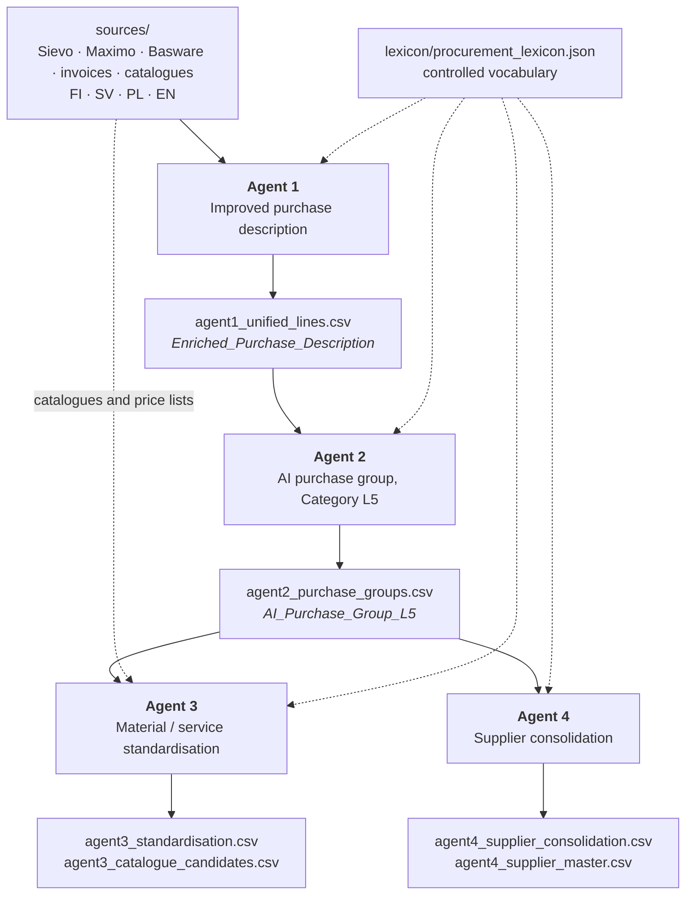

# Fortum AI-Powered Procurement Analysis

Four agents that turn messy, multilingual procurement data into the four
analyses set out in the technical planning workbook: understandable purchase
descriptions, a new purchase-group level beneath the existing category
taxonomy, material and service standardisation opportunities, and supplier
consolidation opportunities.

| Agent | Question it answers | Reads | Writes |
| --- | --- | --- | --- |
| `agent1.py` | What was actually bought? | the source extracts | `agent1_unified_lines.csv` |
| `agent2.py` | What kind of purchase is this? | Agent 1 | `agent2_purchase_groups.csv` |
| `agent3.py` | Could this have been a standard item? | Agent 2 + the client's item catalogue | `agent3_standardisation.csv` |
| `agent4.py` | Who else could supply this? | Agent 2 | `agent4_supplier_consolidation.csv` |

They form a chain. Each one appends columns to the table the previous one
produced, so no analysis has to be recomputed and every result can be traced
back to the source row it came from.

Two runners drive that chain end to end so it does not have to be driven by
hand. `all_agents.py` returns the input table with every agent column added to
it, one row out for each row in; `max.py` builds the wide table from the raw
extracts first and then runs the same four agents over it. Both are described
under [running all four in one command](#running-all-four-in-one-command).

**Author and developer:** Prof. Shahab Anbarjafari

---

## Quick start

```bash
python3 -m venv myenv && source myenv/bin/activate
pip install --upgrade pip && pip install -r requirements.txt
pip install -r requirements-models.txt      # optional, improves accuracy

python all_agents.py --from-sources    # all four agents, raw extracts to one table
```

Or drive the four agents by hand, in order:

```bash
python agent1.py        # then answer the prompts, or press Enter for defaults
python agent2.py
python agent3.py
python agent4.py
```

Results land in `results/`. Nothing else is required: the language model is
optional, and every agent runs to completion without one.

---

## Contents

- [How the agents chain together](#how-the-agents-chain-together)
- [Scope: what is built and what is not](#scope-what-is-built-and-what-is-not)
- [Design principles](#design-principles)
- [Installation](#installation)
- [Preparing a machine that cannot reach Hugging Face](#preparing-a-machine-that-cannot-reach-hugging-face)
- [Running with less than the full stack](#running-with-less-than-the-full-stack)
- [Configuration](#configuration)
- [Running the agents](#running-the-agents)
- [Running all four in one command](#running-all-four-in-one-command)
- [Agent 1 — Improved purchase description](#agent-1--improved-purchase-description)
- [Agent 2 — AI purchase group, Category L5](#agent-2--ai-purchase-group-category-l5)
- [Agent 3 — Material and service standardisation](#agent-3--material-and-service-standardisation)
- [Agent 4 — Supplier consolidation](#agent-4--supplier-consolidation)
- [A worked example](#a-worked-example)
- [Reviewing the output](#reviewing-the-output)
- [What leaves your machine](#what-leaves-your-machine)
- [Repeatability](#repeatability)
- [Running at full volume](#running-at-full-volume)
- [Cost](#cost)
- [Extending the vocabulary](#extending-the-vocabulary)
- [Troubleshooting](#troubleshooting)
- [Repository layout](#repository-layout)
- [Project status and authorship](#project-status-and-authorship)

---

## How the agents chain together



Agents 3 and 4 both read Agent 2's output and are independent of each other, so
they can be run in either order or in parallel. Agent 3 is the only one that
needs reference data beyond the purchase lines.

The column names are the interface between the agents.
`Enriched_Purchase_Description` and `AI_Purchase_Group_L5` in particular are
read by name downstream and should not be renamed without updating the readers.

---

## Scope: what is built and what is not

The planning workbook lists ten items of core AI functionality. Five are
delivered here; the rest were either de-scoped by the client or marked optional.
Stating that plainly avoids the expectation that this repository covers them.

| Workbook item | Priority | Status |
| --- | --- | --- |
| Language standardisation, cross-cutting | Must have 0 | **Delivered** — all four agents emit English and retain the source text |
| Agent 1. Improved purchase description | Must have 1 | **Delivered** — `agent1.py` |
| Agent 2. AI Purchase Group (Category L5) | Must have 2 | **Delivered** — `agent2.py` |
| Agent 3. AI material/service standardisation | Must have 3 | **Delivered** — `agent3.py` |
| Agent 4. AI Supplier Consolidation | Must have 4 | **Delivered** — `agent4.py` |
| Sievo attribute selection | Marked "19.8. Not needed" | Not built; superseded by PO-line-level joins |
| AI Sievo Category Selection | Marked "OLD: combined above" | Not a separate agent; folded into Agent 2's classification |
| AI Business Area / Division Selection | Marked "OLD: combined above" | Not a separate agent; BA and Division are carried through and used as comparison scopes in Agent 4 |
| Category enrichment, levels 1–4 | Optional 1 | Not built |
| Additional purchase classification information | Optional 2 | Not built |
| PO quality / other AI indicators | Optional 3 / TBD | Not built |

Two open items from the workbook are answered in code rather than left hanging.
The similarity threshold that Agent 3 was to have "defined and tested" is
supplied as a documented default plus a calibration file to set it from. The
supplier master that Agent 4 was asked whether the client possesses does not
exist, so one is derived and written out for correction.

---

## Design principles

**The language model is the last resort, not the engine.** Every agent
resolves as much as it can with a curated vocabulary, classical NLP and local
neural models, all of which run on the CPU at no per-row cost. The language
model is consulted only for the residue those layers cannot settle, and only
where an answer would actually change an outcome. All four agents produce
complete output with the model switched off entirely; enabling it improves
coverage rather than making the run possible.

**Output in English, evidence in the original.** Descriptions, group names and
rationales are standardised English regardless of the source language. The
original values are carried through unchanged on the same row, so nothing is
lost and every translation can be checked.

**A measurement and a judgement are different columns.** Similarity scores are
computed quantities. Confidence says how much evidence stands behind them.
Bands say whether the result is worth acting on. Collapsing these into one
number hides exactly the distinctions a reviewer needs, so they are kept apart
throughout.

**Findings are indicators, not assertions.** Agents 3 and 4 identify
opportunities for a procurement expert to review. Each one carries its score,
its confidence and a short rationale naming the evidence behind it.

**Thresholds are argued from the data.** Where the plan leaves a threshold to
be defined, a documented default is supplied and the run writes out the
distribution it should be set from.

---

## Installation

Python 3.9 or newer.

```bash
python3 -m venv myenv
source myenv/bin/activate          # Windows: myenv\Scripts\activate
pip install --upgrade pip
pip install -r requirements.txt
```

Then the local models. Unlike the packages above these are not optional in
practice — see [preparing a machine that cannot reach Hugging
Face](#preparing-a-machine-that-cannot-reach-hugging-face) for why:

```bash
python fetch_models.py                 # the embedder and the translators
```

Then the language resources, both of which really are optional:

```bash
pip install -r requirements-models.txt
python -m nltk.downloader punkt punkt_tab stopwords wordnet omw-1.4
```

`requirements-models.txt` holds the two spaCy pipelines the agents load, English
and the multilingual fallback. They are kept out of `requirements.txt` because
spaCy publishes them on GitHub rather than PyPI, and one unreachable host in the
main file fails the whole install. Without them each agent falls back to
rule-based phrase extraction and logs that it has done so: some accuracy in
reading long descriptions, no change to any column.

On a corporate network that inspects TLS, `pip` reports `self-signed certificate
in certificate chain` for anything it fetches. The proxy re-signs HTTPS with a
root certificate Python does not ship. Allow `pip` through for one install and
let `truststore` deal with it from then on:

```bash
pip install --trusted-host pypi.org --trusted-host files.pythonhosted.org truststore
pip install -r requirements.txt
```

`truststore` verifies against the operating system's certificate store, where the
proxy's root already is, so nothing needs exporting. See
[`self-signed certificate in certificate chain`](#self-signed-certificate-in-certificate-chain)
for the manual alternative on each platform, including Windows, and for what to
do when the hub is blocked rather than re-signed.

## Preparing a machine that cannot reach Hugging Face

The agents run two kinds of model locally: one multilingual sentence embedder,
shared by all four, and a set of small Helsinki-NLP bilingual translators, one
per source language. Both download on first use and cache under
`~/.cache/huggingface`.

`fetch_models.py` only downloads those models. It takes no input file, reads no
extract and writes no column — its `--results` flag names where the *models* go,
not where data is. The script that adds columns to a purchase table is
[`all_agents.py`](#running-all-four-in-one-command), and it writes a new wide file
rather than modifying the extract it read.

Run on a terminal with no options it says so and confirms the two things it does
choose:

```
  This downloads the models the agents run on. It reads no purchase
  data and writes no column: to widen a purchase table, run
  all_agents.py. The folder below is where the models are written.

Which languages should be translatable without the paid model? (fi sv pl de da no nl et fr es it cs, or 'all')
  [fi sv et no de pl]:
Which folder should the models be written to?
  [/Users/you/.cache/huggingface]:
Also write one archive, to carry to a machine that cannot reach the hub? [y/N]:
```

It does not ask when any option is given, when `--check` is used, or when there is
no terminal to ask at; `--non-interactive` forces the defaults.

**A machine that cannot reach `huggingface.co` does not fail. It gets expensive.**
A translator that will not load is treated as an absent optional component, so
the run continues and every foreign phrase goes to the language model instead —
which is the one thing the translators exist to prevent. On a full Fortum extract
that is 365,532 phrases at 25 per request, roughly 14,600 round trips issued one
after another. It is slow, it is not free, and until now nothing in the log
connected it to the download failure a few seconds earlier.

So fetch them deliberately:

```bash
python fetch_models.py            # the embedder and the languages Fortum's data carries
python fetch_models.py --check    # report what is present; exits non-zero if any are missing
```

`--check` is the one to put in front of a long run. It downloads nothing and
tells you whether the run is about to fall back to the paid tier:

```
    present  sentence-transformers/paraphrase-multilingual-MiniLM-L12-v2   457.5 MB
    present  Helsinki-NLP/opus-mt-fi-en                                   577.2 MB
    MISSING  Helsinki-NLP/opus-mt-sv-en
```

A model counts as present only if a snapshot holds real weights, which is
stricter than it sounds and deliberately so. Asking the hub for a repository
that does not exist still leaves a folder, a ref and a `config.json` behind,
about eight kilobytes in all. Anything that tests for the folder calls that
present, reports the machine as ready, and the gap then surfaces hours later as
an agent quietly sending every foreign phrase to the paid tier.

The default set covers the languages the client's extracts actually contain —
Finnish, Swedish, Estonian, Norwegian, German and Polish. `--languages fi sv`
narrows it, `--all-languages` fetches all twelve the agents support. The download
itself is about 2.1 GB with the embedder and takes a couple of minutes on a home
connection, but budget nearer 3.8 GB on disk: the first load of each translator
caches a second weight format beside the one that was downloaded, taking each
folder from about 290 MB to about 580 MB.

Norwegian is the one language whose model is not named after it. Helsinki
publishes no `opus-mt-no-en`; Norwegian lives inside the North Germanic group
model, `opus-mt-gmq-en`, and both agents now ask for that instead. Before this
was corrected the agents requested a repository that has never existed, so every
Norwegian phrase went to the paid tier — 9,781 of them in one real run.

### `self-signed certificate in certificate chain`

This is the usual corporate-network failure, and it is TLS interception rather
than a block. The network re-signs HTTPS with a root of its own. That root is
installed in the operating system's certificate store, which is why the browser
reaches the hub — and Python does not read that store. It trusts certifi's
bundle, which knows nothing about the proxy.

The fix is to let Python read the system store, which needs no certificates
exported and no variables set:

```bash
pip install truststore
```

It is in `requirements.txt`, so a normal install already has it, and every agent
picks it up. When `pip` itself fails the same way, allow it through for that one
install:

```bash
pip install --trusted-host pypi.org --trusted-host files.pythonhosted.org truststore
```

`fetch_models.py` says which store it is verifying against, so you can see it
took effect:

```
  Cache                : /Users/you/.cache/huggingface
  Verifying TLS with   : the operating system trust store
```

It also stops at the first certificate failure rather than working through the
remaining six models. The hub library retries five times per file, so carrying on
meant many minutes of identical failures before anything explained the cause.

#### Exporting the root by hand

Only needed where `truststore` cannot be installed at all. `fetch_models.py`
prints the steps for the platform it is running on; both are recorded here
because the choice of platform is not usually the reader's.

On macOS or Linux:

```bash
security find-certificate -a -p /Library/Keychains/System.keychain > ~/roots.pem
cat "$(python -c 'import certifi; print(certifi.where())')" ~/roots.pem > ~/ca-bundle.pem
export REQUESTS_CA_BUNDLE=~/ca-bundle.pem SSL_CERT_FILE=~/ca-bundle.pem
```

On Windows, in PowerShell:

```powershell
Get-ChildItem Cert:\LocalMachine\Root | ForEach-Object {
  '-----BEGIN CERTIFICATE-----'
  [Convert]::ToBase64String($_.RawData, 'InsertLineBreaks')
  '-----END CERTIFICATE-----' } | Set-Content $env:USERPROFILE\roots.pem -Encoding ascii
$certifi = python -c "import certifi; print(certifi.where())"
Get-Content $certifi, $env:USERPROFILE\roots.pem |
  Set-Content $env:USERPROFILE\ca-bundle.pem -Encoding ascii
$env:REQUESTS_CA_BUNDLE = "$env:USERPROFILE\ca-bundle.pem"
$env:SSL_CERT_FILE = "$env:USERPROFILE\ca-bundle.pem"
```

### `503 Service Unavailable` from the hub

Not a certificate problem, and worth separating from one because the remedy is
the opposite. A 503 means TLS succeeded and something answered — usually the
proxy itself, declining the host as a matter of policy. The giveaway is speed: a
refusal comes back in milliseconds, where a struggling server would take
seconds. No certificate configuration changes it.

Tell an outage apart from a local refusal by asking from somewhere else:

```bash
curl -sI https://huggingface.co/api/models/sentence-transformers/paraphrase-multilingual-MiniLM-L12-v2
```

A `200` there while the run gets 503 means the hub is fine and the block is local
to that machine, so carry the models in instead. `fetch_models.py` recognises
this case, stops at the first refusal rather than retrying five times for each of
seven models, and prints these steps rather than the certificate ones.

### When the network blocks the hub outright

No certificate helps if the hub is unreachable rather than re-signed. Fetch on a
machine that can reach it and carry the archive across.

**The models do not travel with the code.** They are gigabytes of weights in the
Hugging Face cache, not files in the repository, so `git pull` will not bring
them and a machine that has just pulled still has none.

```bash
# on a machine with a route to the hub
python fetch_models.py --all-languages --bundle models.tar.gz
```

On macOS or Linux:

```bash
mkdir -p ~/.cache/huggingface && tar -xzf models.tar.gz -C ~/.cache/huggingface
export HF_HUB_OFFLINE=1
python fetch_models.py --check      # confirms they loaded, with no network at all
```

On Windows, in PowerShell:

```powershell
New-Item -ItemType Directory -Force "$env:USERPROFILE\.cache\huggingface" | Out-Null
tar -xzf models.tar.gz -C "$env:USERPROFILE\.cache\huggingface"
$env:HF_HUB_OFFLINE = "1"
python fetch_models.py --check
```

`HF_HUB_OFFLINE=1` stops the libraries checking the hub for updates, which
otherwise costs a timeout per model on every run.

### If it does fall back anyway

Agent 1 now says so instead of leaving it to be inferred, naming the languages,
the volume and the remedy before it starts spending:

```
WARNING The offline translator would not load for et, fi, no, sv, so 365532
        phrase(s) are going to openai.eu.gpt-5.6-luna instead of being
        translated here for nothing.
WARNING   That is about 14622 request(s), sent one after another, and it is the
          largest avoidable cost in this agent.
WARNING   Stop the run and fetch the local models first if that was not
          intended: python fetch_models.py
```

A long model pass also reports where it has got to once a minute, with an
estimate, so it can be abandoned on evidence rather than on patience:

```
INFO      translated 2,150 of 365,532 phrase(s), batch 86 of 14622, about 31h 20m remaining at this rate
```

---

## Running with less than the full stack

Every dependency is optional and every agent degrades rather than fails. On
start-up each agent logs which components it found:

```
INFO  Optional components: numpy=yes, openpyxl=yes, rapidfuzz=yes, ...
```

What is lost when a component is missing:

| Missing | Effect |
| --- | --- |
| `openpyxl` | `.xlsx` files cannot be read; `.csv` still works |
| `transformers` / `torch` | no offline translation, so every foreign phrase goes to the language model instead — correct, but the most expensive thing in the chain |
| `sentence-transformers` | no semantic matching; lexical comparison is used instead |
| `spacy` | lemmatisation and head-noun detection fall back to suffix rules |
| `nltk` | smaller stop-word lists; no Snowball stemming |
| `rapidfuzz` | `difflib` is used instead, which is much slower on large inputs |
| `scikit-learn` | clustering and nearest-neighbour search use internal fallbacks |

The agents are usable with nothing but the standard library. They are
considerably better with the full stack, and the full stack costs nothing to
run.

---

## Configuration

Copy the template and fill it in:

```bash
cp .env.example .env
```

`.env` is excluded from version control and must never be committed.

```ini
# false -> OpenAI directly (development and testing)
# true  -> PwC GenAI shared service (deployment on the PwC estate)
AZURE_ENABLE=false

OPENAI_API_KEY="sk-..."
OPENAI_BASE_URL="https://api.openai.com/v1"
OPENAI_MODEL="gpt-5.6-luna"

AZURE_OPENAI_API_KEY="sk-..."
AZURE_OPENAI_BASE_URL="https://genai-sharedservice-emea.pwcinternal.com/v1/chat/completions"
AZURE_OPENAI_MODEL="openai.eu.gpt-5.6.luna"

LLM_BATCH_SIZE=25
LLM_TIMEOUT=120
LLM_MAX_REQUESTS=0            # 0 = no cap
LLM_REASONING_EFFORT=low      # gpt-5.6-luna reasoning depth

LLM_SPEND_LIMIT=25.00         # ask before spending past this; 0 = no alert
LLM_INPUT_COST_PER_MTOK=1.25  # dollars per million input tokens
LLM_OUTPUT_COST_PER_MTOK=10.00
```

Both blocks are read independently, so both can be populated at once and
`AZURE_ENABLE` decides which is used. `OPENAI_BASE_URL` deliberately does not
fall back to the shared-service URL, so a direct OpenAI key cannot be sent to
the shared-service endpoint by accident.

The shared service uses the Azure deployment name `openai.eu.gpt-5.6.luna`.
Direct OpenAI uses `gpt-5.6-luna`. Reasoning effort defaults to `low`.

Real environment variables override `.env`, which is what makes the agents
usable from a scheduler without a file on disk.

---

## Running the agents

Run them in order. Each prompts for the paths it needs; press Enter to accept
the value in brackets.

```bash
python agent1.py
python agent2.py
python agent3.py
python agent4.py
```

Every agent also runs unattended, which is what a scheduled job should use:

```bash
python agent1.py --non-interactive --sources ./sources --results ./results
python agent2.py --non-interactive
python agent3.py --non-interactive
python agent4.py --non-interactive
```

`--help` on any agent lists its full option set.

Common options, available on all four:

| Option | Effect |
| --- | --- |
| `--non-interactive` | never prompt; use arguments and defaults |
| `--results DIR` | where to write output (default `./results`) |
| `--lexicon FILE` | the controlled vocabulary |
| `--cache DIR` | model response cache (default `./cache`) |
| `--use-llm` | enable the language-model tier |
| `--llm-spend-limit USD` | ask before spending past this figure (default 25) |
| `--no-jsonl` | skip the JSONL export |
| `--verbose` | debug-level logging |
| `--version` | agent name and version |

When the language-model tier is used, the run ends with a token and cost report:

```
-------------------------------------------------------------------------------
Language model usage
-------------------------------------------------------------------------------
  Model                : gpt-5.6-luna (openai)
  Requests sent        : 18
  Served from cache    : 240 (no tokens consumed)
  Input tokens         : 24,517
    of which cached    : 12,288
  Output tokens        : 3,902
    of which reasoning : 1,344
  Total tokens         : 28,419
  Input cost           : $0.03 at $1.25/M
  Output cost          : $0.04 at $10.00/M
  Estimated cost       : $0.07
  Spend alert          : $25.00
```

---

## Running all four in one command

Running the agents by hand means four commands, four sets of paths, and a merge
afterwards to get the four analyses into one table. Two runners do that instead.

| Runner | Gives you | Use it when |
| --- | --- | --- |
| `all_agents.py` | the input table with every agent column added, one row out per row in | you want the agent columns beside the data you already have |
| `max.py` | the wide table built from the raw extracts, with the same agent columns on the end | you want the joined dataset built as well |

Both run the same four agents in the same dependency order, reuse work already on
disk, and can be interrupted and resumed. They differ in one respect worth
knowing: `all_agents.py` runs Agents 3 and 4 at the same time, since both read
Agent 2 and neither reads the other, so Agent 4 finishes inside the fifteen
minutes Agent 3 spends on the catalogue. Max runs them one after the other.
`--no-parallel` turns that off for a log that reads in order.

### all_agents.py

```bash
python all_agents.py --from-sources     # start from the raw extracts
python all_agents.py --input mytable.csv  # widen a table you already have
python all_agents.py                    # reuse Max's stage-3 table if it is there
```

Where the input comes from is decided in that order of preference: a file named
with `--input`, then the raw extracts if `--from-sources` or `--sources` says so,
then `max_stage3_interpreted.csv` if a previous Max run left one in the results
folder. The run states which of the three it took and never silently substitutes
one for another.

**Every input row is written exactly once.** Rows are matched back by
`Source_Row_Number`, not by position or by description, so a row an agent could
not annotate comes out with those columns empty rather than dropped. The count is
reconciled at the end, and rows that came back short are named in
`all_agents_row_audit.csv` — a file that only appears when there is something in
it.

Output:

| File | Contents |
| --- | --- |
| `all_agents_dataset.csv` | the input table plus every agent column |
| `all_agents_dataset.jsonl` | the same rows, nested |
| `all_agents_run_manifest.json` | input taken, catalogue used, per-agent status, columns added, spend |
| `all_agents_row_audit.csv` | rows an agent could not annotate, when there are any |
| `all_agents/` | each agent's own output and log, kept as it was written |

Where an agent's column name already exists in the input, the agent's version is
prefixed and the input keeps both its name and its value. Six columns collide on
Fortum's data — `Country`, `Division`, `Item_Or_Service`, `PO_Number`,
`PO_Line_Number` and `Quantity` — so Agent 1's reading of each arrives as
`Agent1_Country` and so on, beside the original. Nothing is overwritten, and the
run lists every rename it made along with what each agent contributed.

Rows are also cross-checked rather than trusted: where an agent republished a
business key that was already on the row, the two values are compared. The run
reports how many were checked and how many disagreed, which on the sample is
`confirmed on 88 business-key value(s), 0 disagreement(s)`.

One thing worth knowing about the merge: a later agent in the chain re-emits some
of the earlier columns, and occasionally re-emits them empty. Taking the last
agent's table at face value therefore loses values an earlier agent had already
established. `AI_Confidence` is the one this happens to on Fortum's data — Agent 1
fills 18 of the 25 sample rows, and Agent 3 republishes the column blank. Those
cells are read back from the agent that produced them rather than left empty, and
the run says so:

```
  Put back after the chain dropped them (1)
    AI_Confidence: 18 value(s)
    A later agent republished the column and left it empty. The value an
    earlier agent produced was read from its own output instead.
```

### max.py

```bash
python max.py --non-interactive --sources ./sources --results ./results
python max.py --no-agents      # stop at stage 3, the joined table only
```

Six stages: Sievo and the invoices are joined, the purchase-order lines are
brought in, the result is interpreted into harmonised columns, and then Agents 1,
2 and 3 widen it in turn. The headline file is
`max_stage6_standardised.csv`; every stage before it is kept, so a stage can be
inspected without rerunning the ones before.

Agent 4 does not fit that shape — it answers per supplier and scope, not per
purchase line — so rather than being folded into the row it is written alongside
as `max_supplier_consolidation.csv`, `max_supplier_pairs.csv` and
`max_supplier_master.csv`. `Supplier_Key` appears on the wide table too, resolved
exactly as Agent 4 resolved it, so the two cannot disagree about which rows belong
to which company and the consolidation findings can be joined back onto the lines.

`max.py` refuses to finish quietly if a promised column is missing. It names the
agent that failed, why, and what to do about it, instead of listing lost column
names and leaving the cause to be guessed at.

### Reuse, interruption and resuming

An agent whose output was built from the same input, by the same script, with the
same settings is not run again; it is reused, and the run says so. Force the work
with `--force` (`--force-agents` on Max), or discard everything including the
joined table with `--no-reuse`.

Interrupting with Ctrl-C stops the running agents, records how far the run got,
and removes the half-written file of the stage that was in progress. The next run
finds that record and offers to carry on from there or start again:

```
12:39:00  WARNING A previous run in this results folder did not finish.
12:39:00  WARNING   Finished and reusable : stages 1 and 2, stage 3
12:39:00  WARNING   Stopped during        : the agents
Carry on from there rather than starting again [Y/n]:
```

Answered for you when the run is unattended: it carries on, and says so.
`--restart` on Max, or `--force` on `all_agents.py`, starts from the beginning
instead.

A long agent is not killed for being slow. What is watched is silence: an agent
that has printed nothing for two hours is treated as hung, which is
`--agent-silence-timeout`. An absolute ceiling is available as `--agent-timeout`
but is off by default, because the earlier fixed six-hour limit killed Agent 1
mid-run on the full extract and cost the whole chain.

### One run at a time in a results folder

Both runners take a lock on the results folder and refuse to start if another run
already holds it:

```
12:48:31  ERROR   Not starting: another run is already writing to this folder:
                  process 73160, started 2026-09-02T12:48:10.
  Wait for it to finish, or stop it, or point this run at a different --results folder.
```

Two runs sharing a folder do not collide loudly, which is what makes this worth
preventing. Every stage writes to a fixed name, so they interleave: each
overwrites the other's agent outputs, the reuse stamps stop describing the files
beside them, and the dataset that survives is whichever run happened to finish
last. It looks complete and is a mixture of two configurations. Two runs of
`all_agents.py` once overlapped by seventeen minutes this way and reported
catalogue match counts that disagreed.

A lock left behind by a run that was killed is reported and taken over rather
than obeyed, so a stale file cannot block the folder permanently. If you need to
clear one by hand it is `.run.lock` for `all_agents.py` and `.build.lock` for
Max. To run two things at once, give each its own `--results` folder.

### Model spend across the four

Each agent tracks its own tokens; the runner adds them up and reports the total,
separating what this run spent from what the reused results had already cost, so
a cheap-looking rerun is not mistaken for a cheap analysis:

```
  Language model
    Agent 1    $    0.03  19 request(s), 7,659 in / 1,904 out (reused, spent on an earlier run)
    Agent 2    $    0.00  0 request(s), 0 in / 0 out (reused, spent on an earlier run)
    Agent 3    $    0.00  1 request(s), 272 in / 186 out (reused, spent on an earlier run)
    Agent 4    $    0.00  0 request(s), 0 in / 0 out (reused, spent on an earlier run)
    this run   $    0.00  0 request(s), 0 answer(s) served from cache
    recorded   $    0.03  including the reused agents' earlier spend
    Estimated from the published rates, an upper bound rather than an invoice.
```

The per-agent spend alert still applies to each agent individually, so one agent
cannot quietly spend the whole budget.

---

## Agent 1 — Improved purchase description

Makes free-text purchases understandable. It reads every extract in the source
folder, works out what each line was actually for, and writes one clear English
description per line without inventing anything.

```
$ python agent1.py
Source data folder
  [/path/to/sources]:
Results folder
  [/path/to/results]:
Controlled vocabulary file
  [/path/to/lexicon/procurement_lexicon.json]:
Cache folder
  [/path/to/cache]:

Use the offline neural translation models (recommended, free)? [Y/n]:
Use embedding-based matching for unlinked lines? [Y/n]:
Use the language model for phrases the local stack cannot resolve? [y/N]:
```

### How a description is built

A purchase line rarely describes itself completely. The material text, the
supplier's product name, the PO line text and the project name each hold part of
the answer, and the same purchase often appears in several source systems with
different fragments in each. Agent 1 links those records, gathers the evidence
and composes a single description from it.

Translation runs as a cascade, cheapest first:

1. **Controlled vocabulary** — curated procurement phrases and terms in Finnish,
   Swedish, Polish and German. Exact, auditable and free.
2. **Compound decomposition** — Nordic compounds split into known parts, so
   `asbestipurkutyo` resolves to asbestos + removal + work without an entry for
   every inflected form.
3. **Offline neural translation** — Helsinki-NLP `opus-mt` models running
   locally on CPU. This tier removes the largest single language-model cost.
4. **Language model** — gpt-5.6-luna with low reasoning. When this tier is on,
   it also re-reads every line and writes `Enriched_Purchase_Description` as
   one or two English sentences. Residue the local stack could not translate
   is batched and cached in the same pass.

The tier that produced each description is recorded in `Translation_Method`, and
`Translation_Coverage` gives the share of content tokens the local stack
resolved.

### Output

| File | Contents |
| --- | --- |
| `agent1_unified_lines.csv` | one row per purchase line, common schema |
| `agent1_unified_lines.jsonl` | the same rows with the full evidence bundle |
| `agent1_<source>.csv` | each source file, unchanged, with the enriched columns appended |
| `agent1_run_manifest.json` | input hashes, configuration, statistics, tokens |

The per-source files carry a short set of appended columns so they stay readable
next to the original data; `--full-columns` widens them to the complete unified
schema.

Key columns:

| Column | Meaning |
| --- | --- |
| `Enriched_Purchase_Description` | one or two English sentences naming what was bought |
| `Enriched_Description_Short` | a compact form for narrow reports |
| `Item_Or_Service` | material, service, or `Unclear` when the line does not say what was bought |
| `AI_Confidence` / `Confidence_Band` | 0–100 and High/Medium/Low |
| `Original_Description` | the source text, unchanged |
| `Item_Number` / `Item_Type` | the item number and how the line was raised, for Agent 3 |
| `Detected_Language` | the language the source text was written in |
| `Translation_Method` | which tier of the cascade produced the English |
| `Translation_Coverage` | share of content tokens the local stack resolved |
| `Evidence_Sources` | which fields the description was built from |
| `Match_Tier` / `Match_Score` | how the source records were linked |
| `Country` / `Country_Source` | the country, and the column it was read from |
| `Row_Id` | stable identifier, reproducible across runs |

Business keys — supplier, category L1 to L4, business area, division, spend,
dates — are carried through unchanged for the downstream agents.

`Country` is the one business key that is decided rather than copied. Fortum
settled the definition: the delivered-to country, or the company-code country
where no delivery address was recorded, as on an invoice. The choice is made per
line, so one extract can answer both ways, and `Country_Source` names the column
that answered on each row. Supplier country is never used — see
[Which country](#which-country) under Agent 4, which is where the distinction
matters.

Numbers that describe the purchase survive enrichment: wattage, DN/PN sizes,
quantities, and an item number the source text names, as in `item 970094`. A
bare long digit run is treated as a document reference and dropped. A line whose
only free text was a buyer note — Fortum's `Confirmed with site manager` — is
reported as `Unclear` with an empty description rather than guessed from its
category or its supplier.

Two rules keep that promise. Columns that name a party or a person — `Supplier
name`, `Requested by`, `Approved by` — are never read as purchase text, in an
inferred profile or a declared one, so a note-only line cannot fall through and
be published as its supplier's name. And `Item_Or_Service` is never blank: when
nothing can be published, because the text was a note, because it would not
render in English, or because there was no text at all, the line is `Unclear`
rather than an empty cell or an unearned `Material`.

A service is usually named after the thing it is performed on, so a line such as
`Centrifugal pump maintenance` carries one word of each kind. Counting marker
words alone ties, which used to send the line to `Unclear` even though it says
plainly what was bought. The last word of an English noun phrase is its head, and
that is what was purchased: `Pump repair` is a service, `Repair kit` is a
material. Ties are broken that way on the line's own text only — never on the
surrounding categories, whose order carries no meaning.

The word `service` is still the only word the agent adds, and it is now added
only where it lands on a noun. `Gas Electric Charges 10th 14th March 2024` and
`Hire Charges for` are left as they were written rather than having a noun
stuck on the end of a date or a dangling preposition.

---

## Agent 2 — AI purchase group, Category L5

Creates a new analytical level beneath the existing L1–L4 taxonomy.
`Asbestos removal service`, `Asbestos demolition` and `Asbestipurku` collapse to
one group named `Asbestos removal`.

```
$ python agent2.py
Agent 1 unified table
  [/path/to/results/agent1_unified_lines.csv]:
Results folder
  [/path/to/results]:
Controlled vocabulary file
  [/path/to/lexicon/procurement_lexicon.json]:
Group registry (keeps labels stable across runs)
  [/path/to/lexicon/agent2_group_registry.json]:
Cache folder
  [/path/to/cache]:

Use multilingual sentence embeddings (recommended, free)? [Y/n]:
Let the language model name groups the rules could not name well? [y/N]:
```

### How grouping works

Descriptions are reduced to a signature of lemmas, then clustered within a
category bucket. Clustering is agglomerative rather than k-means, because the
number of groups is not known in advance and agglomerative clustering is
deterministic given the same input.

Group names come from consensus, not from a model: the lemmas that a strict
majority of members use, presented in the order the members most often put them
in. Applied to *asbestos removal service*, *asbestos demolition* and *asbestos
removal*, this keeps "asbestos" and "removal" and drops the rest, producing
`Asbestos removal`. A label can therefore only ever describe something that was
actually purchased. The language model is offered the few groups where this
produces a weak name, and nothing else.

Words that say how a purchase was fulfilled rather than what was purchased —
`delivery`, `incl. delivery`, `for site use`, `replacement`, `supply of`,
`(standard)` — are removed before the signature is taken. `Bat survey for wind
site incl. delivery` therefore lands in the same group as `Bat survey for wind
site` instead of becoming a category of its own. A line whose only content word
is one of them keeps it, because that line really did buy a delivery, and
`power supply` keeps its head noun.

`site` is the awkward one, because it names the purchase in Fortum's own `Bat
survey for wind site` and names only the fulfilment in `for site use`. It is
dropped when it is the site of a *use* and kept everywhere else; without that
distinction, `Tank cleaning service for site use` split off into a category
called `Tank cleaning service site`.

The threshold adapts per category to land within the target group count. Lines
that cannot be grouped confidently go to `Other` rather than being forced into a
group they do not belong in. The number of Category L5 names is capped at 6000
including `Other`; groups are ranked by the spend behind them and anything past
the ceiling joins `Other`, so no row leaves the analysis.

Worth being precise about what that ceiling does, because it is easy to expect the
other behaviour. It **truncates rather than coarsens**: the 5,999 groups carrying
the most spend keep exactly the names they had, and every remaining group — however
sensible — is folded into `Other` wholesale. It does not merge similar groups into
broader ones, so the surviving names are no less granular than they were without
the cap. `groups_folded_into_other` in the run manifest counts what went that way,
and a large number there means detail was discarded, not generalised.

Granularity is set by `--threshold` instead, the clustering distance at which two
descriptions are treated as the same purchase. The default 0.35 is deliberately
fine, which is why a 4,546-line extract can produce over a thousand groups — about
four lines each, close to the description level. Raising it merges neighbouring
descriptions, so it is the lever to pull if the L5 names read as too specific.

It is a gentler lever than it looks. Swept across the 4,546-line extract, on a real
Agent 1 pass with the model tier enabled:

| `--threshold` | Groups | Lines per group | Singletons | In `Other` |
|---|---|---|---|---|
| 0.25 | 1,208 | 3.8 | 707 | 421 |
| 0.35 (default) | 1,088 | 4.2 | 600 | 421 |
| 0.45 | 966 | 4.7 | 498 | 421 |
| 0.55 | 842 | 5.4 | 380 | 421 |
| 0.65 | 626 | 7.3 | 270 | 893 |

Nearly tripling the distance only halves the group count, and even at 0.65 there
are 626 names for 4,546 lines. The threshold alone will not turn
description-level detail into a browsable category tree.

The reason it cannot is visible in the names it produces. At the default, 60% of
the 1,088 names contain the supplier's own name, covering 66% of lines —
`Device accessory purchase telia finland`, `Dataverse purchase capacity crayon
under`, `Office cleaning service carry koloryt`. Agent 1's enrichment writes a
faithful sentence, and a faithful sentence names who supplied the thing, so the
supplier reaches the signature and splits one purchase type across as many groups
as it has vendors. The enrichment's connecting verbs do the same on a smaller
scale: `purchase`, `carry`, `provide`, `supply` and `under` all survive into
labels and separate otherwise identical lines by phrasing. Amazon web services
lands in three groups at once — `Amazon web service purchase capacity` (35 lines),
`Aws capacity service purchase amazon` (22) and `Amazon web service capacity
purchase` (15) — and scaffolding and insulation each split two ways on word order
alone.

So a group count near the line count is mostly a signature problem rather than a
distance problem, and raising `--threshold` treats the symptom. The bigger gain
would come from dropping the supplier name — which arrives in its own column and
need not be inferred — and the enrichment's filler verbs before the signature is
taken. Until that is done, expect roughly a thousand L5 names per five thousand
lines whatever the threshold, and read the ceiling accordingly: at this
granularity a full extract reaches 6000 names quickly, and everything past it is
folded into `Other` rather than generalised.

One caveat on the numbers above: the extract is 85% IT and indirect services,
which fragments differently from materials, so sweep again on representative spend
before fixing a threshold for a full run.

Useful options:

| Option | Effect |
| --- | --- |
| `--threshold` | clustering distance threshold (default 0.35) |
| `--min-groups` / `--max-groups` | target groups per category (default 10–50) |
| `--no-adaptive` | fix the threshold instead of adapting it |
| `--bucket-level` | cluster within L1, L2, L3, L4 or `auto` |
| `--max-label-words` | words in a group name (default 5) |
| `--max-total-groups` | ceiling on L5 names including `Other` (default 6000) |

### Output

| File | Contents |
| --- | --- |
| `agent2_purchase_groups.csv` | every Agent 1 row with the group appended |
| `agent2_purchase_groups.jsonl` | the same rows with the grouping evidence |
| `agent2_group_directory.csv` | one row per group with its members |
| `agent2_run_manifest.json` | configuration, statistics, tokens |

Appended columns: `AI_Purchase_Group_L5`, `AI_Purchase_Group_Id`,
`AI_Purchase_Group_Confidence`, `AI_Purchase_Group_Band`,
`AI_Purchase_Group_Size`, `AI_Purchase_Group_Category`,
`AI_Purchase_Group_Cohesion`, `AI_Purchase_Group_Naming`,
`AI_Purchase_Group_Is_New`.

---

## Agent 3 — Material and service standardisation

Answers two separate questions. Retrospectively: which free-text purchases could
have been bought as an existing standard item? Prospectively: which recurring
free-text purchases should become catalogue items?

The second needs no reference data at all, so this agent is useful before a
complete set of price lists has been supplied.

```
$ python agent3.py
Purchase table (from Agent 2, or Agent 1)
  [/path/to/results/agent2_purchase_groups.csv]:
Item catalogue folder (catalogues only)
  [/path/to/catalogues]:
Reference data folder (catalogues and price lists)
  [/path/to/sources]:
Results folder
  [/path/to/results]:
...
Use multilingual sentence embeddings (recommended, free)? [Y/n]:
Translate reference descriptions with the offline models? [Y/n]:
Let the language model adjudicate borderline matches? [y/N]:
```

### Catalogues, and only catalogues

Fortum sends item catalogues separately from the master data, so they get an
input of their own. The client's current master is

```
sources/Fortum-ItemCatalogues-Master.xlsx      845,428 items, 36 MB
```

which is what the two runners look for by name, and what Agent 3 reads when
neither `--reference` nor `--catalogues` names something else. Run Agent 3 on its
own and it still accepts a file or a folder either way, reading every file
beneath it whatever its layout; `--reference` suppresses the `./catalogues`
default so a run pointed somewhere explicitly is never quietly redirected.

**Check the catalogue is the client's latest before you run.** A stale catalogue
does not fail; it silently proposes fewer matches, and reports them as
confidently as it would report the right number. This is not hypothetical: an
earlier 4,200-item extract of the same catalogue is still on disk under the same
name, and reading it instead of the 845,428-item master costs 99.5% of the items
a purchase could have matched — with nothing in the output to say so.

The runners therefore prefer the master, and name what they took along with what
they passed over:

```
  Catalogue Agent 3 matched against
    the client's catalogue master, found in the source folder
    Fortum-ItemCatalogues-Master.xlsx: 845,428 item(s), modified 2026-08-31 12:15, sha256 d0941c52fc59
    0 line(s) matched a catalogue item, 0 were already standard purchases
    best candidate scored 0.630, acceptance threshold 0.65
    not used: Fortum - Item Catalogues - Master.xlsx in the catalogues folder, 193,174 bytes
```

Every file is named with its date, size and digest, which is enough to tell two
versions apart at a glance.

If no catalogue is loaded at all, the run says so in place of those numbers
rather than reporting nought matches as if that were a finding:

```
  NO CATALOGUE WAS LOADED - no match can be proposed.
```


What a purchase is matched against decides whether the answer means anything. A
catalogue lists what may be bought; a purchase extract records what *was* bought,
and carries the identity of a document along with the amounts and dates of one
event. Any file with two or more of those columns is refused as a catalogue, and
so is a file whose only description column names a company rather than an item.
Both refusals are reported by name and reason, because a file left out silently
makes an incomplete run look like a complete one:

```
  Not treated as catalogues:
    Basware PO data.xlsx (purchase transactions, not a catalogue: carries
    ordernumber, polinenum, polinenumber, requisitionnumber and 9 more)
```

Without this, pointing `--reference` at a folder that held both gave `Int UK
Delivery Costs` a confident match to a "standard item" called `Delivery`, taken
from a purchase order file, and `Sievo with PO line numbers.csv` was absorbed
with `ERP supplier name` as its item description.

A catalogue that cannot be read is an error rather than an omission. If a
spreadsheet is present and `openpyxl` is missing, the file is listed under
`COULD NOT BE READ` and recorded in the manifest instead of vanishing.

### Functional equivalence, not resemblance

The requirement is that a match be based on what an item *does*, not on how it
reads. Two descriptions can be near-identical and denote parts that will not
substitute; two can share no words at all and be the same product.

Four layers, and the last is the one that matters:

- **Translation** — reference items are rendered in English first, so a Polish
  catalogue and a Finnish purchase line are compared on equal terms.
- **Semantic** — multilingual embeddings connect wordings with nothing lexical
  in common.
- **Lexical** — character n-grams anchor the semantic view.
- **Constraints** — a type gate and a specification comparison decide whether
  two things are the same *kind* of thing at the same *size and rating*.

The type gate treats objects and services differently, and that distinction is
the point of it rather than an exception to it. An object is identified by what
it *is*: "wireless headphones" and "wireless keyboard" share a modifier and are
not substitutes. A service is identified by what it acts *on*, and the verb
naming it varies freely: "asbestos removal", "asbestos demolition" and "asbestos
disposal" are one service. The specification comparison then rejects the pairs
that read alike and are not substitutes, such as a DN50 and a DN200 valve.

### What is matched, and what is already standard

Matching runs against the best *original* description the row carries —
`Original_Description`, then the PO or invoice line text — because it is the
original that names the specific product a catalogue entry has to be recognised
as. The enriched English sentence is the fallback for a row whose original text
is missing or a placeholder such as `n/a`. `Match_Source_Column` records which
field was used.

`Standard_item` says whether the line was already raised against a catalogue,
which each source system reports differently:

| Source | `Standard_item` is `Y` when |
| --- | --- |
| Basware | `Item type` is `External webshop` or `Market place` |
| Maximo | `ITEMNUM` carries any value |

A Basware free-text line is therefore `N` whatever supplier product code it
happens to carry. `Potential_Standard_Match` then takes one of three values:
`Yes`, `No`, or `Already standard/catalogue purchase` when `Standard_item` is
`Y`. Whenever the answer is not `Yes`, every matched column is left empty — the
five `Matched_*` fields, both scores, the band, the method, the rationale, the
compatibility and specification verdicts, the price difference and the
alternatives — so the file cannot be read as proposing a match it did not make.
Why there was no match is still reported, in `No_Match_Reason`, which is a column
of its own precisely so that nothing in the matched set has to be populated to
carry it.

That rule keeps the file honest but leaves a nil result hard to interpret, since a
line that just missed and a line with nothing remotely comparable look identical.
Three further columns close that gap without touching the matched set:

| Column | Meaning |
| --- | --- |
| `Closest_Considered_Score` | the highest score reached by any item examined, accepted or not |
| `Closest_Considered_Item_ID` | which catalogue item that was |
| `Closest_Considered_Description` | how that item is described |

They are filled for every row that was looked up, so a blank `Similarity_Score`
beside a `Closest_Considered_Score` of 0.62 says the threshold decided it, while
0.11 says the catalogue does not stock the thing. Being named `Closest_Considered_*`
rather than `Matched_*` and sitting outside `MATCHED_COLUMNS`, they cannot be read
as a proposed match, and they are reported below the reporting threshold too — a
line whose best was 0.35 has no candidate at all yet still shows how far off it
was.

### Thresholds

The plan leaves the similarity threshold to be defined and tested. The defaults
are `--high-threshold 0.80`, `--medium-threshold 0.65` (the accept threshold)
and `--minimum-threshold 0.50`. Every run writes
`agent3_match_calibration.csv`, giving the number and share of lines that would
be accepted at every cut-off from 0.20 to 1.00. Set the thresholds from that
file rather than from the defaults.

The defaults have since been shown to work, which is worth recording because the
opposite was believed for a while. Run against the full 845,428-item master with
the catalogue translated, the twenty-five line sample accepts 2 matches at 0.65
and reaches a top score of 0.703:

| | p10 | p25 | p50 | p75 | p90 | max |
|---|---|---|---|---|---|---|
| Best-match score | 0.519 | 0.519 | 0.549 | 0.636 | 0.679 | 0.703 |

Earlier the same sample matched nothing and topped out at 0.630, which read as an
accept threshold set slightly too high. It was not. That run loaded the correct
master, but every translation model failed to load under `transformers` 5.x, so
301,557 catalogue descriptions stayed in Finnish, Swedish, German and Polish while
being compared against English purchase text. Nothing could score well, and the
agent reported a nil result rather than a broken one.

With the loader fixed and the catalogue translated, the same sample and the same
threshold accept matches. So 0.65 is not the obstacle it appeared to be, and the
lesson is to check the run before the setting: confirm the reference file and item
count in the summary, and confirm the translation tier loaded, before drawing any
conclusion about the threshold. Where it should finally sit is still Fortum's
decision, taken against the calibration file on a representative extract rather
than a twenty-five line sample.

### Reading a nil result: is it the threshold, or the catalogue?

A run that matches nothing has two quite different causes, and they call for
opposite responses. Before touching the threshold, check whether the lines could
match at all.

The master catalogue is a materials catalogue. Its single sheet holds 846,024 rows,
of which 845,428 survive loading as usable items, and 840,795 of them — 99.4% —
are Ahlsell SE (512,640) and Ahlsell FI (328,155), a technical wholesaler. They
read like it: `KAAPELIKELA 20M 3G1 OHUT IP20`, `LAIPPAKULMAYHDE FFK/DN300/45AST`,
`PAINEPUTKI BIOZINALIUM ZNAL DN200X6000`. Cable reels, flanged bends, pressure
pipe.

The 4,546-line test extract in `sources/subset2` buys almost none of that:

| Category L1 | Lines | Share |
|---|---|---|
| IT | 2,311 | 50.8% |
| Indirect Services and Materials | 1,568 | 34.5% |
| Energy assets | 587 | 12.9% |
| Fuels | 78 | 1.7% |

Half of it is ServiceNow licences, SaaS subscriptions, Check Point support
renewals, security consultants and agency staffing hours. No threshold makes a
ServiceNow licence match a pressure pipe. On that extract nil is the right
answer, and only the ~6.6% in `Production supplies and consumables`, with parts
of `Civil Works` and `Production maintenance`, is even in Ahlsell's territory.

Measured on materials spend, where the catalogue does apply, the agent performs as
intended. Four thousand lines drawn from `Production supplies and consumables`,
`Civil Works`, `Automation and Electrification`, `Mechanical and Main Equipment`
and `Hardware and Accessories`, run against the full master:

| | Lines | Share |
|---|---|---|
| Matched at 0.65 or above | 421 | 10.5% |
| of which High band | 138 | 3.5% |
| of which Medium band | 283 | 7.1% |
| Best score reached | 0.970 | |

Against 0% on the IT and services extract, so the domain, not the agent, sets the
rate. The strongest matches are exact:

```
0.97  LED-pistokantalamppu DULUX DE26 HF 10W/840 G24Q-3
   -> LED-PISTOKANTALAMPPU DULUX D/E HF 10W/830 G24Q-3     AHLSELL FI   9.39
0.97  Kauluslaippa DN80 PN16 P250GH EN1092-1/11
   -> KAULUSLAIPPA EN 1092-1/11 DN80/88.9 P250GH PN16       AHLSELL FI  19.23
0.92  SUODATUSYKS 2340016 HYDAC MFU15E9SMFE/NX9DM010FSDN
   -> SUODATUSYKS 2340016 HYDAC MFU15E9SMFE/NX9DM010FSDN    AHLSELL FI  3698.50
```

Two limitations are worth stating before anyone treats a match as a purchasing
instruction. The agent identifies the product family reliably but not always the
variant: a few accepted matches pair the right garment or fitting in the wrong
size, such as `MIDJEBYXA ... STL C46` against `MIDJEBYXA ... STL C146` at 0.90, or
a DN25 check valve against a DN100 ball valve. And the guard meant to catch that,
`Specification_Agreement`, reads `Not stated` on 405 of the 421 matches, because
garment sizes and DN/PN ratings are not among the specifications it extracts. It is
therefore close to inert on this spend rather than actively confirming anything.
Treat `High` as "this is the right item family, check the variant" rather than "this
is the right stock code", and read `Matched_Item_Description` before acting.

The threshold is not leaving much on the table here: of the 3,579 unmatched lines
with a score, only 32 sit between 0.60 and 0.65, and the median is 0.438. Dropping
the accept threshold to 0.60 would add under one percentage point.

So a nil result is worth explaining before it is corrected:

- **The extract is out of the catalogue's domain.** Nothing to fix. Expect a low
  match rate on IT and services spend however the threshold is set, and judge the
  agent on materials lines instead.
- **The catalogue was never translated.** The likeliest cause, and invisible in the
  output. Two thirds of the master is Finnish, Swedish, German or Polish; if the
  translation tier fails to load, that text is matched against English and scores
  far too low. The run logs `Translation model ... unavailable` and carries on. This
  is what produced the first nil result on the full master.
- **A stale or partial catalogue was loaded.** Check the reference file named in the
  run summary and its item count. The 4,200-item copies under `catalogues/` and
  `feedback/` cost 99.5% of the items a line could have matched.
- **The threshold is above the score distribution.** Read
  `agent3_match_calibration.csv`, which gives the accepted share at every cut-off.
  Consider this last, and only once the two above are ruled out — it was blamed
  first and was not the cause.

More lines do not help either way. Each line is scored against all 845,428 items
independently, so a larger extract raises the number of matches only in
proportion to how much of it the catalogue actually covers — it does not make any
single line match better.

Read `Closest_Considered_Score` to tell the two apart per row: it carries the best
score reached whether or not the match was accepted, so the distinction is visible
in the merged table rather than only in the calibration file. Against the stale
4,200-item copy one sample line came within 0.45 of a desk it plausibly matched
while the rest sat between 0.10 and 0.28 — the difference between a threshold worth
arguing about and a catalogue that does not stock the item.

### Translating the catalogue, once

About three hundred thousand catalogue items are described in Finnish, Swedish,
German or Polish, and each has to be in English before it can be compared with
anything. Measured on the 845,428-item master, that is not the hour a short
benchmark suggests but nearly five, and it used to be paid on every run,
producing the same strings from the same catalogue:

| Language | Items | Time |
| --- | --- | --- |
| German | 108,756 | 1h 34m |
| Swedish | 116,740 | 2h 16m |
| Finnish | 70,101 | 47m |
| Polish | 5,960 | 3m |
| then embedding all 845,428 | | 7m |

Those translations are now kept in `cache/agent3_translation_cache.json` and
reused, so a second run over an unchanged catalogue skips the hour and does not
even load the translation models. A catalogue that gains items pays only for the
items it gained. The cache is keyed by model and source text rather than by
catalogue, so two catalogues sharing an item share its translation, and it is
written as soon as translation finishes rather than at the end of the run — the
embedding pass comes next and is also long, and an interrupt between the two
would otherwise throw the hour away.

Beam search is fixed and sampling is off, so a remembered translation is the one
the model would produce again. `--no-translation-cache` renders from scratch,
which is worth doing only to prove that.

One consequence worth knowing: Agent 3 got slower before it got faster. When the
translator would not load, this stage was skipped in silence and the whole agent
took nineteen minutes, comparing Finnish catalogue text against English purchase
text and scoring nonsense. A first run now takes about 4h 50m. Every run after it
is back to about twenty minutes, because the translations are read rather than
recomputed.

Those long passes now report where they have got to every minute:

```
14:31:02  INFO    Translating 116740 reference description(s) from sv.
14:32:03  INFO      sv: 3488 of 116740 translated, about 2h 12m remaining
```

That is not cosmetic. Both runners treat a silent agent as a hung one, and
`max.py` kills one that has said nothing for two hours. Swedish alone took 2h 16m
in silence, so Max would have killed Agent 3 part way through rendering the
catalogue — and because Agents 2 and 3 read what comes before them, that is how a
single silence loses all fifty-six enrichment columns. The progress line keeps
the agent audibly alive as well as telling you when it will finish.

Read that 0.630 as a property of one run rather than of the data. Scores depend on
what text was compared, and therefore on whether the translation tier was working.
The same sample against the same master gives:

| Catalogue | Top score | Matches at 0.65 |
|---|---|---|
| left in Finnish, Swedish, German and Polish | 0.630 | 0 |
| translated to English | 0.703 | 2 |

Cross-language scores are not meaningful, and neither is a threshold set from them.
Confirm with `python fetch_models.py --check` that the translators are present
before taking any calibration figure seriously.

### Output

| File | Contents |
| --- | --- |
| `agent3_standardisation.csv` | one row per purchase line with its best match |
| `agent3_standardisation.jsonl` | the same rows with all candidates |
| `agent3_catalogue_candidates.csv` | recurring free-text worth listing |
| `agent3_match_calibration.csv` | score distribution for threshold work |
| `agent3_run_manifest.json` | configuration, statistics, tokens |

A purchase becomes a catalogue candidate on frequency, spend and price
stability: `--candidate-min-occurrences` (default 3) and
`--candidate-min-spend` (default 1000).

---

## Agent 4 — Supplier consolidation

Finds materials and services bought from more than one supplier, and ranks the
consolidation opportunities that follow.

```
$ python agent4.py
Purchase table (from Agent 2)
  [/path/to/results/agent2_purchase_groups.csv]:
Results folder
  [/path/to/results]:
Controlled vocabulary file
  [/path/to/lexicon/procurement_lexicon.json]:
Supplier registry file
  [/path/to/lexicon/agent4_supplier_registry.json]:
Cache folder
  [/path/to/cache]:

Scope levels to compare within, separated by spaces
  [Category_L1 Category_L2 Category_L3 Category_L4 Business_Area Division]:
Relate near-identical purchase groups with embeddings (recommended, free)? [Y/n]:
Let the language model adjudicate borderline supplier pairs? [y/N]:
```

### Portfolios, not descriptions

Consolidation is a question about portfolios. Two purchase lines being alike
proves nothing on its own — every supplier of any size sells something some
other supplier also sells. The question a category manager needs answered is:
*of everything we buy from this supplier, how much could that other supplier
have delivered instead?*

So the unit of comparison is a supplier within a scope, and the measure is

```
coverage(A -> B) = sum over items of A of  weight(item) x match(item, B)
                   -------------------------------------------------------
                                    total weight of A
```

weighted by spend where spend is populated and by line count where it is not.
Wording is not compared at all: the comparison runs on the AI Purchase Group
Agent 2 assigned, which has already collapsed the language and phrasing that
differ between suppliers. Where Agent 2 drew a group boundary through the middle
of one product, embeddings recover the connection with partial credit.

### Direction matters

The measure is asymmetric, and this is the most important thing about the
output. A specialist supplier can be entirely covered by a full-range
distributor while the distributor is barely covered by the specialist. Reported
symmetrically that pair looks like a weak opportunity in both directions;
reported directionally it says exactly what to do.

```
Drive Systems AB     -> Nordic Automation Oy   sim 100%  rev  50%   High
Nordic Automation Oy -> Drive Systems AB       sim  50%  rev 100%   Medium
```

Both rows describe the same pair. The first says all of Drive Systems' trade is
available from Nordic Automation; the second says only half of Nordic
Automation's is available from Drive Systems. Drive Systems is the one to
consolidate away.

### Which country

Fortum asked what the country in this agent actually was, and settled the
definition: **the delivered-to country, or the company-code country where no
delivery address was recorded** — which is the normal case for an invoice, since
an invoice records who was billed rather than where the goods went.

The choice is made per line, not per file, so an extract carrying a delivery
country on its order rows and nothing on its invoice rows is answered correctly
on both. Agent 1 applies the rule and writes the answer to `Country`, along with
the column it read it from in `Country_Source`; Agent 4 reads that. Every run
states which columns answered, so the question does not have to be asked again:

```
  Country read from    : Country 22
    3 line(s) carry no country at all and are compared without one.
    Delivery country was not present, so this is the company-code country throughout.
```

**Supplier country is never used.** It used to sit second in the fallback chain,
so any line without a company country reported the country its supplier invoices
from. That is a different question, and a damaging one to confuse here: Agent 4
compares two suppliers' portfolios, so a country taken from the supplier would
have `Same_Country` comparing each supplier with itself. Three checks in the test
harness hold this in place — that delivery wins where present, that the fallback
is per line, and that the supplier's country is never borrowed.

No current Fortum extract carries a delivery country; Basware supplies
`Organization country` and Sievo's `Country` is the company one, so in practice
every line is answered from the company code today. The preference is implemented
so that a delivery country appearing in a future extract wins automatically, and
`Country_Source` will show it without anybody having to check the code.

### Partners in another country

Fortum has asked to *consider* restricting suggestions by country and has not
settled it. Until it is settled, the run reports the cross-border pairs rather
than withholding them, and says how many there are:

```
  Cross-border best    : 26 of 181 rows name a partner in another country
    Pass --same-country-only to withhold those; Same_Country says which they are.
```

That is the figure the decision turns on, and `Same_Country` names the rows.
`--same-country-only` applies the restriction, and a supplier whose country is
unknown is treated as foreign rather than assumed local. Country also breaks a
tie in the partner ranking — where two partners cover the same share, the
domestic one is easier to consolidate onto — but never more than that. Promoting
a domestic partner over one that genuinely covers more would put a lower number
at the top of a row than the row itself reports.

### Bands

The client asked the agent to propose the ranges rather than be given them. The
proposal, exposed as `--high-similarity` and `--medium-similarity`:

| Band | Coverage | Reading |
| --- | --- | --- |
| High | 60% or more | a sourcing conversation is warranted |
| Medium | 30% to 60% | a real but partial overlap |
| Low | under 30% | the incidental overlap any two suppliers in a category show |

`Similarity_Band` applies these directly. `Consolidation_Potential` is the same
band after materiality is weighed: it is demoted when less than
`--min-addressable-spend` (default 10,000) is at stake, when either side has
fewer than `--min-evidence-lines` (default 3) behind the finding, or when
confidence is low. The two are separate columns so neither judgement is hidden
inside the other.

That last gate matters more than it sounds. Without it, a supplier who bought a
frequency converter once appears as a full alternative source of frequency
converters, because coverage is measured entirely from the *other* supplier's
portfolio and nothing in it notices how little trade sits behind the match.

### Supplier identity

There is no supplier master to normalise against, so one is derived. Vendor
names are stripped of legal forms — `Siemens Oy`, `SIEMENS OY AB` and
`Siemens Oy Ab` become one supplier — and vendor numbers pull differently
spelled names together.

Geographic qualifiers such as "Nordic" and "International" are deliberately
*not* stripped, because they distinguish one company from another: remove them
and `Nordic Cleaning Oy` becomes indistinguishable from
`Cleaning International AB`. Vendors that survive as separate records while
looking like the same company are flagged in `agent4_supplier_master.csv`
rather than merged, because a wrong merge is invisible and corrupts every
number in the run, while a wrong flag is a line a reviewer dismisses in a
second.

To make a merge permanent, add it to the `overrides` block of the supplier
registry and it will be respected on every future run:

```json
{
  "overrides": {
    "acme subsidiary": "acme"
  }
}
```

### Output

| File | Contents |
| --- | --- |
| `agent4_supplier_consolidation.csv` | one row per supplier per scope |
| `agent4_supplier_consolidation.jsonl` | the same rows with every partner |
| `agent4_supplier_pairs.csv` | one row per compared supplier pair |
| `agent4_supplier_master.csv` | the derived vendor master and duplicate flags |
| `agent4_run_manifest.json` | configuration, statistics, tokens |

Key columns of the headline file:

| Column | Meaning |
| --- | --- |
| `Scope_Level` / `Scope_Value` | the slice the comparison was made within |
| `Consolidation_Potential` | High / Medium / Low, after materiality |
| `Similarity_Band` / `Similarity_Percent` | share of this supplier the partner covers |
| `Reverse_Similarity_Percent` | share of the partner this supplier covers |
| `Mutual_Similarity_Percent` | the smaller of the two |
| `AI_Confidence` | how much evidence stands behind the figure |
| `Most_Similar_Supplier` | the best alternative source |
| `Addressable_Spend_EUR` | this supplier's spend the partner could serve |
| `Partner_Lines_On_Shared_Items` | the partner's own trade in the shared items |
| `Top_5_Other_Similar_Suppliers` | the next best alternatives with their shares |
| `Possible_Duplicate_Vendor` | set when the "partner" may be the same company |
| `Reason` | the finding in plain words |

Rows are written primary scope first, then strongest opportunity first, so the
file opens on what should be read.

---

## A worked example

Illustrative rather than measured, but it is the shape every row takes. A single
Finnish purchase line as it travels the chain:

**In the source extract.** The description field is a code welded to an
abbreviation, the supplier name is in one system and the price in another:

```
Material text : 157238asbestipurku
Supplier      : Rakennus Palvelu Oy
Category L2   : Maintenance services
Spend         : 4 820,00
```

**After Agent 1.** The code is separated from the words, the Finnish resolves
through the controlled vocabulary at no token cost, and the evidence is kept:

```
Enriched_Purchase_Description : Asbestos removal work was carried out at the site.
Item_Or_Service               : Service
Detected_Language             : fi
Translation_Method            : vocabulary
Translation_Coverage          : 1.00
Original_Description          : 157238asbestipurku
AI_Confidence                 : 86  (High)
```

**After Agent 2.** It joins the other wordings of the same purchase — *Asbestos
demolition*, *Asbestin purkutyö*, *Rivning av asbest* — under one name derived
from what the members actually wrote:

```
AI_Purchase_Group_L5 : Asbestos removal
AI_Purchase_Group_Id : G-3F2A91C4
```

**After Agent 3.** No catalogue item covers it, but the purchase recurs and its
unit price is stable, so it surfaces on the other list:

```
Catalogue_Candidate : Yes
Occurrences         : 34      Distinct_Suppliers : 5
Total_Spend_EUR     : 168,400 Price_Stability    : 0.91
```

**After Agent 4.** Five suppliers are selling the same service, and the
directional measure says which way any consolidation should run:

```
Supplier             : Rakennus Palvelu Oy
Most_Similar_Supplier: Nordic Sanering AB
Similarity_Percent   : 78     Reverse_Similarity_Percent : 34
Addressable_Spend_EUR: 131,300
Consolidation_Potential : High   AI_Confidence : 81
Reason: 78% of Rakennus Palvelu Oy spend in Maintenance services is on items
        Nordic Sanering AB also supplies, chiefly Asbestos removal (1 purchase
        group shared exactly). Nordic Sanering AB has the broader portfolio and
        could absorb this volume.
```

The original Finnish text is still on the row at every step.

---

## Reviewing the output

The workbook is explicit that a procurement expert confirms whether the
purchases and suppliers a model flags are genuinely comparable. The output is
built for that step rather than to replace it.

Which file to open depends on how the agents were run: each agent's own headline
file if they were run by hand, `all_agents_dataset.csv` after `all_agents.py`, or
`max_stage6_standardised.csv` after Max. The advice below applies to all three,
since the columns are the same.

**Start with the bands, not the scores.** Both Agent 3 and Agent 4 sort their
headline file so that the rows worth reading are at the top — primary scope
first, strongest opportunity first.

**Read the reason column before the numbers.** Every finding carries a sentence
naming the evidence behind it. If the sentence does not survive contact with
what you know about the supplier, the number will not either.

**Check confidence separately from similarity.** A 100% similarity at 40%
confidence is a claim about a supplier with almost no history. The two columns
exist so that this case looks different from a 70% similarity at 95% confidence,
which is a far stronger finding.

**Check `Possible_Duplicate_Vendor` first in Agent 4.** A "consolidation
opportunity" between two records of the same company is a data-quality finding,
not a sourcing one. `agent4_supplier_master.csv` lists these, and any merge you
confirm belongs in the registry's `overrides` block so it holds on future runs.

**Feed corrections back into the vocabulary.** Where a description was
misunderstood, the fix is normally a phrase in
`lexicon/procurement_lexicon.json`. That is deterministic, free, and improves
every future run and every agent at once.

---

## What leaves your machine

Procurement data is commercially sensitive, so it is worth being precise about
this.

**With the language-model tier off — the default — nothing leaves the machine.**
Every component runs locally: the vocabulary, spaCy, NLTK, the Helsinki-NLP
translation models and the sentence-embedding model all execute on the CPU
against local files. The only network access is the one-off model download at
installation, which can be done ahead of time and staged for an air-gapped
machine.

**With it on, only short text fragments are sent**, and only those the local
layers could not resolve: an untranslatable phrase, a pair of item descriptions
sitting on a match threshold, a list of purchase-group names. Whole rows,
supplier identities, spend figures and source files are never transmitted.

The destination is whichever backend `AZURE_ENABLE` selects. `OPENAI_BASE_URL`
deliberately has no fallback to the shared-service URL, so a direct OpenAI key
cannot be sent to the PwC endpoint by accident, and the reverse cannot happen
either.

Everything sent is cached locally under `cache/`, so a repeated run transmits
nothing at all. That cache contains fragments of client data and, like
`sources/` and `results/`, is excluded from version control.

---

## Repeatability

The plan requires that a future production run find the same items and the same
suppliers again. This is a design constraint rather than a side effect:

- Identifiers are content-derived, not positional. `Row_Id`,
  `AI_Purchase_Group_Id` and `Supplier_Key` are hashes of the content they
  identify, so they are identical on any machine and in any order.
- Iteration and tie-breaking are sorted throughout. Where two candidates score
  equally, the winner is decided alphabetically rather than by dictionary order.
- Clustering is agglomerative, which has no random initialisation.
- Language-model calls use `temperature=0` and are cached on a hash of the
  request, so a repeated run consumes no tokens and cannot drift.
- Registries persist group labels and supplier keys, and carry an `overrides`
  block for corrections that must survive future runs.

The one operator decision that can break this is the spend alert: a run that
switched the model off half way through will not match a run that kept it on,
because part of the work took the deterministic path instead. The manifest flags
this with `spend_limit_stopped`, and the cache means the answers already paid for
are reused rather than re-purchased on the next attempt.

Verifying it takes one command:

```bash
python agent4.py --non-interactive --results ./run1
python agent4.py --non-interactive --results ./run2
diff -r run1 run2                     # no output
```

---

## Running at full volume

The target is roughly one million purchase lines. Guidance:

**Run the agents in order.** Agent 4 is far faster and far more accurate with
Agent 2's purchase groups than with raw descriptions, because the groups have
already collapsed a million lines into a few thousand distinct items.

**Install the full stack.** `rapidfuzz` and `scikit-learn` in particular are the
difference between minutes and hours; the pure-Python fallbacks are correct but
slow.

**Expect the work to be dominated by distinct values, not rows.** Agents 1 and 3
process each distinct description once and apply the result to every row that
carries it. Agent 4 aggregates lines into portfolios and never touches a line
again.

**Budget Agent 3's first run separately.** Its cost is dominated by the catalogue
rather than by the purchase lines: rendering the 845,428-item master into English
takes about 4h 40m however many rows are being matched, and the same run over
twenty-five lines and over a million takes almost the same time. That is paid
once and then read from `cache/agent3_translation_cache.json`, so plan the first
run around it and expect roughly twenty minutes afterwards. See [translating the
catalogue, once](#translating-the-catalogue-once).

**Watch the scope guards in Agent 4.** A scope holding thousands of suppliers is
usually too broad to give a useful answer, and the comparison cost grows with
the square of that number. Scopes above `--max-scope-suppliers` (default 5000)
are skipped with a warning rather than allowed to run for hours; compare within
a narrower level instead.

**The pairs file can get large.** `agent4_supplier_pairs.csv` has one row per
comparable supplier pair per scope, which can run to hundreds of thousands of
rows. It is an analysis artefact; the headline file is the one to read. Restrict
`--scopes` if it is not needed.

### Measured reference point

Agent 4 over synthetic data on a laptop, with **none** of the optional packages
installed, so the pure-Python fallbacks were in use throughout:

| Lines | Suppliers | Purchase groups | Scopes | Wall clock |
| --- | --- | --- | --- | --- |
| 300,000 | 900 | 600 | 14 | 22 s |

The cost of Agents 1 and 3 is set by the number of *distinct descriptions*
rather than the number of lines, so it depends far more on how repetitive the
data is than on how large it is. Agent 2's clustering is the most expensive step
in the chain and is the one to time first on real data.

**Agent 3 has a fixed cost that does not depend on the purchase data at all.**
Every item in the catalogue has to be embedded before anything can be matched
against it, and the client's master holds 845,428 of them. Measured on a laptop
over two runs of the same 25-line sample:

| Catalogue items | Purchase lines | Agent 3 wall clock | Agents 1, 2 and 4 together |
| --- | --- | --- | --- |
| 845,428 | 25 | 15–18 min | 15 s |

Almost all of that is the catalogue rather than the twenty-five lines, so a run of
a million lines pays the same quarter of an hour once. It is why the runners stream
the agents' logs live rather than waiting in silence, why `all_agents.py` runs
Agent 4 alongside Agent 3 instead of after it, and why a slow agent is never
killed for being slow.

Installing `rapidfuzz`, `scikit-learn` and `numpy` improves all of these
substantially and costs nothing at run time.

---

## Cost

With the language-model tier switched off, the agents cost nothing beyond
compute. Every neural component runs locally on CPU.

With it switched on, cost stays low by construction:

- The model sees only the residue the local layers could not resolve.
- It is asked only where an answer changes an outcome — borderline matches, not
  matches already decided at 0.95 or 0.30.
- Requests are batched (`LLM_BATCH_SIZE`).
- Every response is cached on a hash of the request, so re-running is free.
- `LLM_MAX_REQUESTS` caps a run against an unexpected input distribution.

The token report at the end of each run states exactly what was consumed,
separating fresh input tokens from cached ones and output tokens from reasoning
tokens.

Every one of those points rests on the local layers actually being there. The
residue the model sees is small because the vocabulary, the compound
decomposition and the offline translators have already absorbed almost all of it;
remove the translators and the residue becomes the whole multilingual half of the
data. That is not a small regression — it is the difference between a few hundred
requests and fourteen thousand — and it happens silently, because a missing model
is an absent optional component rather than an error. Run
`python fetch_models.py --check` before a long run; see [preparing a machine that
cannot reach Hugging Face](#preparing-a-machine-that-cannot-reach-hugging-face).

The cheapest way to improve quality is to extend the vocabulary, not to enable
the model.

### The spend alert

Answering yes to the language-model question brings up a second question:

```
  Charged at $1.25 per million input tokens and $10.00 per million output tokens.
  The run pauses at the figure below and asks before spending more.
Alert when estimated language-model spend reaches (USD)
  [25.00]:
```

From then on the agent values every response as it arrives, at $1.25 per million
input tokens and $10.00 per million output tokens by default. When the running
estimate reaches the figure given, the run stops and asks:

```
===============================================================================
  Language-model spend alert
===============================================================================
  Estimated spend      : $25.43
  Authorised so far    : $25.00
  Input tokens         : 1,240,512 at $1.25/M = $1.55
  Output tokens        : 2,388,401 at $10.00/M = $23.88
  Requests sent        : 412

  Answering yes raises the limit to $50.00.
  Answering no finishes the run on the local stack alone.
  Continue using the language model? [y/N]:
```

Answering `y` authorises one more increment of the same size, so $25 becomes
$50, then $75, and so on; each step asks again. Answering `n` switches the model
off and the run **continues to completion** on the local NLP stack, keeping
everything the model had already produced. Nothing is lost and no output file is
left half-written — the model tier was always optional.

Three details worth knowing:

- The estimate is built from the token counts the API reports, so it lags the
  true figure by at most one response. Cached input is valued at the full input
  rate even though the provider discounts it, which makes the estimate an upper
  bound. It is a guard rail, not an accounting record; the invoice is the
  authority.
- Under `--non-interactive` there is nobody to ask, so reaching the limit
  switches the model off and logs a warning. A scheduled job therefore has a
  hard ceiling rather than an open-ended bill. Set `--llm-spend-limit` to the
  most that run may spend, or to `0` to remove the ceiling.
- The manifest records `spend_limit_usd`, `spend_limit_extensions` and
  `spend_limit_stopped`, so a run that lost the model part way through is
  distinguishable afterwards from one that had it throughout. That distinction
  matters when comparing two runs' output.

Rates are configurable through `LLM_INPUT_COST_PER_MTOK` and
`LLM_OUTPUT_COST_PER_MTOK` for when published prices change or the shared
service quotes its own.

---

## Extending the vocabulary

`lexicon/procurement_lexicon.json` is the controlled procurement vocabulary. It
is shared by all four agents, resolves deterministically and never consumes a
token, which makes it the highest-leverage file in the repository.

| Section | Purpose |
| --- | --- |
| `phrases` | multi-word procurement terms per language, matched first, longest first |
| `terms` | single words, matched against both the raw token and its stem |
| `compound_parts` | drives the Nordic compound splitter |
| `service_markers` / `material_markers` | separate work from goods |
| `noise_terms` | placeholder values to ignore |
| `unit_terms` | unit normalisation |
| `legal_forms` | incorporation suffixes, removed from supplier names |
| `geographic_qualifiers` | market and region words, treated as weak but not removed |

Bump `version` on every change. The value is written into every output row, so
any result can be traced back to the vocabulary that produced it.

### One rule about numbers

An entry translates words, never specifications. It must not name a size, rating
or standard that the phrase it translates does not name, and it must not match one
in order to replace it — a phrase substitution swaps out the whole span it
matches, so `DN50` inside the matched text disappears.

The vocabulary broke both halves of this. Every Finnish, Swedish and Polish word
for a heat meter translated to `District heating meter DN25`, so a line that
never mentioned a size acquired one; and `Virtauslahetin DN50 4-20mA` came back
as `Flow transmitter 4-20 mA`, with the stated `DN50` silently replaced. Both are
now `District heating meter` and `Flow transmitter`, and the size comes from the
line: `Flow transmitter DN50 4-20mA`.

`python TestAgent.py --agent agent1` fails if any entry breaks this, so the rule
is enforced against the file rather than trusted to review.

Agent 1 also puts the spelling back. Enrichment matches on the folded,
lower-cased text, so a surviving `DN50` would otherwise be published as `dn50`
and `4-20mA` as `4 20ma`. Each specification in a published description is
copied from the source line, and a span the source does not contain is left
alone, so nothing is guessed at:

```
Virtauslahetin DN50 4-20mA   ->  Flow transmitter DN50 4-20mA
Virtauslahetin               ->  Flow transmitter
```

---

## Troubleshooting

**`Input file not found`** — the agent could not find the previous agent's
output. Run the agents in order, or pass `--input` explicitly.

**`... has no 'Enriched_Purchase_Description' column`** — the input was not
produced by Agent 1. That column is the interface between the agents.

**`No 'AI_Purchase_Group_L5' column`** (Agent 4, warning) — Agent 2 has not been
run. Agent 4 proceeds by comparing descriptions directly, which is slower and
blunter. Run Agent 2 first.

**`Fewer than two distinct suppliers were found`** — the supplier column is
empty. Check that `Supplier_Name` or `Supplier_Id` survived Agent 1.

**`Language-model tier requested but no API key was found`** — `--use-llm` was
passed but `.env` has no key for the selected backend. Note that
`AZURE_ENABLE=true` reads `AZURE_OPENAI_API_KEY`, not `OPENAI_API_KEY`.

**`Estimated language-model spend is $... at or above the ... limit`** — the
spend alert fired during an unattended run and the model was switched off for
the remainder. The run still completed on the local stack. Raise
`--llm-spend-limit`, or accept the result: the affected work simply used the
deterministic path.

**`Reading ... needs openpyxl`** — `pip install openpyxl`, or convert the
workbook to CSV.

**`Translation model Helsinki-NLP/opus-mt-fi-en unavailable`** — the model is
neither cached nor reachable, so that language goes to the language model
instead. Run `python fetch_models.py`. If the message ends in `We couldn't
connect to 'https://huggingface.co'` the network is the problem; if it ends in
`Unknown task translation` the installed `transformers` is a version the agents
no longer use that path on, so reinstall from `requirements.txt`.

**A run has been silent for hours** — check the last line before the silence. If
it is `Sending N unresolved phrase(s)` with N in the hundreds of thousands, the
local translators did not load and the paid tier is doing their work; the run now
warns about this and prints progress with an estimate once a minute.
`all_agents.py` will not kill it, but `max.py` stops an agent that has said
nothing for two hours, so a genuinely silent stretch is not safe there. Stopping
it yourself is safe — but note that Agent 1 writes its translation cache only
when it finishes, so stopping discards what has been paid for so far.

**Mangled characters in the output** — the source file was exported through the
wrong code page. The agents repair the common double-encoding damage
automatically, but characters that were already replaced with `?` at export time
are unrecoverable and the file must be re-exported.

**Everything lands in `Other`** (Agent 2) — usually a sign that Agent 1's
descriptions are weak. Check `Translation_Coverage` and `AI_Confidence` in
`agent1_unified_lines.csv` before adjusting `--threshold`.

**Too many or too few groups** (Agent 2) — adjust `--min-groups` and
`--max-groups`; the threshold adapts to meet them.

**No matches at all** (Agent 3) — check the run summary first. If it says `NO
CATALOGUE WAS LOADED`, the catalogue never arrived and nothing below that line
means anything. If a catalogue was loaded, check its date and digest are the
client's latest, and that it covers the categories actually being purchased, then
read `agent3_match_calibration.csv` before lowering the threshold.

**A run read the wrong catalogue** (Agent 3) — `./catalogues` is used by default,
and a named `--catalogues` folder becomes the whole answer. Naming `--reference`
suppresses the default. The summary lists every file that was read, with its
date and digest, and the runners additionally list under `not used` any older
copy they passed over. If that line names the file you expected, the copy you
meant to use is the smaller one.

**`n promised column(s) did not reach the final table`** (Max) — an agent failed
or was abandoned, so its columns were never produced. The message names which
agent and why; the usual cause is an agent killed by `--agent-timeout`. Leave
that off and let it finish. Nothing is lost by rerunning: the agents that did
complete are reused.

**A runner appears to have hung** (Agent 3) — on its first run against the full
master, Agent 3 spends about 4h 40m rendering the catalogue into English and then
seven minutes embedding all 845,428 items. Both report progress, and the runner
prints a heartbeat besides, so silence can be told apart from a stall:

```
  [Agent 3] 14:32:03  INFO      sv: 3488 of 116740 translated, about 2h 12m remaining
  [Agent 3] still working, 14m 13s elapsed, quiet for 60s
```

An agent that has genuinely said nothing for two hours is treated as hung and
stopped by `max.py`. This used to be reachable in normal operation: before the
per-minute progress line existed, rendering Swedish alone took 2h 16m without
printing anything, and Max would have killed Agent 3 in the middle of it. If you
ever do need to allow a longer silence, it is `--agent-silence-timeout`.

**A rerun finished suspiciously fast** — the agents were reused rather than run,
because their inputs and settings were unchanged. The summary marks each one
`reused` and the spend report separates `this run` from `recorded`. Pass
`--force` to make them run again regardless.

---

## Repository layout

```
.
├── agent1.py                          Improved purchase description
├── agent2.py                          AI purchase group (Category L5)
├── agent3.py                          Material and service standardisation
├── agent4.py                          Supplier consolidation
├── all_agents.py                      runs all four, returns the input table widened
├── max.py                             builds the wide table, then runs all four
├── fetch_models.py                    fetch and verify the local models, or bundle them
├── lexicon/
│   └── procurement_lexicon.json       controlled procurement vocabulary
├── requirements.txt                   Python dependencies, all from PyPI
├── requirements-models.txt            optional spaCy pipelines, from GitHub
├── .env.example                       language-model configuration template
├── .gitignore
└── README.md
```

Created at run time and excluded from version control:

```
sources/                               client data, including the item catalogue master
catalogues/                            an alternative place to keep catalogues for Agent 3
results/                               generated output
results/all_agents/                    each agent's own output and log from a runner
cache/                                 language-model responses, and Agent 3's
                                       catalogue translations
lexicon/agent2_group_registry.json     stable group labels
lexicon/agent4_supplier_registry.json  stable supplier keys and merge overrides
results/.run_journal.json              how far an interrupted all_agents.py run got
results/.max_run_journal.json          the same, for max.py
.env                                   credentials
```

Client data and generated output are never committed.

---

## Project status and authorship

Proof of concept. The four "must have" agents from the technical planning
workbook are complete, run end to end, and have been exercised against the
sample extracts and against synthetic data at volume. Client review of the four
agents found no major changes needed; the two points it did raise — which country
Agent 4 compares on, and keeping Agent 3's catalogue current — are settled above
under [which country](#which-country) and
[catalogues, and only catalogues](#catalogues-and-only-catalogues).

Both runners have been run against the client's full 845,428-item catalogue
master, and the resume path has been exercised by interrupting a run and carrying
it on. The thresholds and bands remain documented defaults intended to be revised
once they have been read against real output at volume — Agent 3's accept
threshold in particular, which the sample extract sits just below — and the
vocabulary is expected to grow as the data is worked.

All four agents and both runners were designed, written and tested by
**Prof. Shahab Anbarjafari**, who is the sole author and contributor to this
repository.

