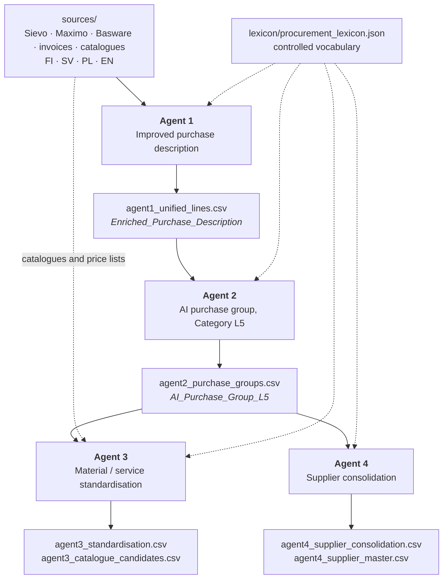

# Fortum AI-Powered Procurement Analysis

Four agents that turn messy, multilingual procurement data into the four
analyses set out in the technical planning workbook: understandable purchase
descriptions, a new purchase-group level beneath the existing category
taxonomy, material and service standardisation opportunities, and supplier
consolidation opportunities.

| Agent | Question it answers | Reads | Writes |
| --- | --- | --- | --- |
| `agent1.py` | What was actually bought? | the source extracts | `agent1_unified_lines.csv` |
| `agent2.py` | What kind of purchase is this? | Agent 1 | `agent2_purchase_groups.csv` |
| `agent3.py` | Could this have been a standard item? | Agent 2 + catalogues | `agent3_standardisation.csv` |
| `agent4.py` | Who else could supply this? | Agent 2 | `agent4_supplier_consolidation.csv` |

They form a chain. Each one appends columns to the table the previous one
produced, so no analysis has to be recomputed and every result can be traced
back to the source row it came from.

**Author and developer:** Prof. Shahab Anbarjafari

---

## Quick start

```bash
python3 -m venv myenv && source myenv/bin/activate
pip install --upgrade pip && pip install -r requirements.txt

python agent1.py        # then answer the prompts, or press Enter for defaults
python agent2.py
python agent3.py
python agent4.py
```

Results land in `results/`. Nothing else is required: the language model is
optional, and every agent runs to completion without one.

---

## Contents

- [How the agents chain together](#how-the-agents-chain-together)
- [Scope: what is built and what is not](#scope-what-is-built-and-what-is-not)
- [Design principles](#design-principles)
- [Installation](#installation)
- [Configuration](#configuration)
- [Running the agents](#running-the-agents)
- [Agent 1 — Improved purchase description](#agent-1--improved-purchase-description)
- [Agent 2 — AI purchase group, Category L5](#agent-2--ai-purchase-group-category-l5)
- [Agent 3 — Material and service standardisation](#agent-3--material-and-service-standardisation)
- [Agent 4 — Supplier consolidation](#agent-4--supplier-consolidation)
- [A worked example](#a-worked-example)
- [Reviewing the output](#reviewing-the-output)
- [What leaves your machine](#what-leaves-your-machine)
- [Repeatability](#repeatability)
- [Running at full volume](#running-at-full-volume)
- [Cost](#cost)
- [Extending the vocabulary](#extending-the-vocabulary)
- [Troubleshooting](#troubleshooting)
- [Repository layout](#repository-layout)
- [Project status and authorship](#project-status-and-authorship)

---

## How the agents chain together



Agents 3 and 4 both read Agent 2's output and are independent of each other, so
they can be run in either order or in parallel. Agent 3 is the only one that
needs reference data beyond the purchase lines.

The column names are the interface between the agents.
`Enriched_Purchase_Description` and `AI_Purchase_Group_L5` in particular are
read by name downstream and should not be renamed without updating the readers.

---

## Scope: what is built and what is not

The planning workbook lists ten items of core AI functionality. Five are
delivered here; the rest were either de-scoped by the client or marked optional.
Stating that plainly avoids the expectation that this repository covers them.

| Workbook item | Priority | Status |
| --- | --- | --- |
| Language standardisation, cross-cutting | Must have 0 | **Delivered** — all four agents emit English and retain the source text |
| Agent 1. Improved purchase description | Must have 1 | **Delivered** — `agent1.py` |
| Agent 2. AI Purchase Group (Category L5) | Must have 2 | **Delivered** — `agent2.py` |
| Agent 3. AI material/service standardisation | Must have 3 | **Delivered** — `agent3.py` |
| Agent 4. AI Supplier Consolidation | Must have 4 | **Delivered** — `agent4.py` |
| Sievo attribute selection | Marked "19.8. Not needed" | Not built; superseded by PO-line-level joins |
| AI Sievo Category Selection | Marked "OLD: combined above" | Not a separate agent; folded into Agent 2's classification |
| AI Business Area / Division Selection | Marked "OLD: combined above" | Not a separate agent; BA and Division are carried through and used as comparison scopes in Agent 4 |
| Category enrichment, levels 1–4 | Optional 1 | Not built |
| Additional purchase classification information | Optional 2 | Not built |
| PO quality / other AI indicators | Optional 3 / TBD | Not built |

Two open items from the workbook are answered in code rather than left hanging.
The similarity threshold that Agent 3 was to have "defined and tested" is
supplied as a documented default plus a calibration file to set it from. The
supplier master that Agent 4 was asked whether the client possesses does not
exist, so one is derived and written out for correction.

---

## Design principles

**The language model is the last resort, not the engine.** Every agent
resolves as much as it can with a curated vocabulary, classical NLP and local
neural models, all of which run on the CPU at no per-row cost. The language
model is consulted only for the residue those layers cannot settle, and only
where an answer would actually change an outcome. All four agents produce
complete output with the model switched off entirely; enabling it improves
coverage rather than making the run possible.

**Output in English, evidence in the original.** Descriptions, group names and
rationales are standardised English regardless of the source language. The
original values are carried through unchanged on the same row, so nothing is
lost and every translation can be checked.

**A measurement and a judgement are different columns.** Similarity scores are
computed quantities. Confidence says how much evidence stands behind them.
Bands say whether the result is worth acting on. Collapsing these into one
number hides exactly the distinctions a reviewer needs, so they are kept apart
throughout.

**Findings are indicators, not assertions.** Agents 3 and 4 identify
opportunities for a procurement expert to review. Each one carries its score,
its confidence and a short rationale naming the evidence behind it.

**Thresholds are argued from the data.** Where the plan leaves a threshold to
be defined, a documented default is supplied and the run writes out the
distribution it should be set from.

---

## Installation

Python 3.9 or newer.

```bash
python3 -m venv myenv
source myenv/bin/activate          # Windows: myenv\Scripts\activate
pip install --upgrade pip
pip install -r requirements.txt
```

Then the language resources:

```bash
python -m spacy download en_core_web_sm
python -m spacy download fi_core_news_sm
python -m spacy download sv_core_news_sm
python -m spacy download pl_core_news_sm
python -m spacy download de_core_news_sm
python -m spacy download nb_core_news_sm
python -m spacy download xx_ent_wiki_sm

python -m nltk.downloader punkt punkt_tab stopwords wordnet omw-1.4
```

The translation and embedding models download on first use and are cached under
`~/.cache/huggingface` (roughly 1 GB in total). To fetch them ahead of time, or
to stage them for a machine without internet access:

```bash
python -c "from sentence_transformers import SentenceTransformer; \
           SentenceTransformer('sentence-transformers/paraphrase-multilingual-MiniLM-L12-v2')"
python -c "from transformers import pipeline; \
           [pipeline('translation', model=f'Helsinki-NLP/opus-mt-{p}') \
            for p in ('fi-en', 'sv-en', 'pl-en', 'de-en')]"
```

### Running with less than the full stack

Every dependency is optional and every agent degrades rather than fails. On
start-up each agent logs which components it found:

```
INFO  Optional components: numpy=yes, openpyxl=yes, rapidfuzz=yes, ...
```

What is lost when a component is missing:

| Missing | Effect |
| --- | --- |
| `openpyxl` | `.xlsx` files cannot be read; `.csv` still works |
| `transformers` / `torch` | no offline translation; the vocabulary and the language model cover it |
| `sentence-transformers` | no semantic matching; lexical comparison is used instead |
| `spacy` | lemmatisation and head-noun detection fall back to suffix rules |
| `nltk` | smaller stop-word lists; no Snowball stemming |
| `rapidfuzz` | `difflib` is used instead, which is much slower on large inputs |
| `scikit-learn` | clustering and nearest-neighbour search use internal fallbacks |

The agents are usable with nothing but the standard library. They are
considerably better with the full stack, and the full stack costs nothing to
run.

---

## Configuration

Copy the template and fill it in:

```bash
cp .env.example .env
```

`.env` is excluded from version control and must never be committed.

```ini
# false -> OpenAI directly (development and testing)
# true  -> PwC GenAI shared service (deployment on the PwC estate)
AZURE_ENABLE=false

OPENAI_API_KEY="sk-..."
OPENAI_BASE_URL="https://api.openai.com/v1"
OPENAI_MODEL="gpt-5.6-luna"

AZURE_OPENAI_API_KEY="sk-..."
AZURE_OPENAI_BASE_URL="https://genai-sharedservice-emea.pwcinternal.com/v1/chat/completions"
AZURE_OPENAI_MODEL="openai.eu.gpt-5.6.luna"

LLM_BATCH_SIZE=25
LLM_TIMEOUT=120
LLM_MAX_REQUESTS=0            # 0 = no cap
LLM_REASONING_EFFORT=low      # gpt-5.6-luna reasoning depth

LLM_SPEND_LIMIT=25.00         # ask before spending past this; 0 = no alert
LLM_INPUT_COST_PER_MTOK=1.25  # dollars per million input tokens
LLM_OUTPUT_COST_PER_MTOK=10.00
```

Both blocks are read independently, so both can be populated at once and
`AZURE_ENABLE` decides which is used. `OPENAI_BASE_URL` deliberately does not
fall back to the shared-service URL, so a direct OpenAI key cannot be sent to
the shared-service endpoint by accident.

The shared service uses the Azure deployment name `openai.eu.gpt-5.6.luna`.
Direct OpenAI uses `gpt-5.6-luna`. Reasoning effort defaults to `low`.

Real environment variables override `.env`, which is what makes the agents
usable from a scheduler without a file on disk.

---

## Running the agents

Run them in order. Each prompts for the paths it needs; press Enter to accept
the value in brackets.

```bash
python agent1.py
python agent2.py
python agent3.py
python agent4.py
```

Every agent also runs unattended, which is what a scheduled job should use:

```bash
python agent1.py --non-interactive --sources ./sources --results ./results
python agent2.py --non-interactive
python agent3.py --non-interactive
python agent4.py --non-interactive
```

`--help` on any agent lists its full option set.

Common options, available on all four:

| Option | Effect |
| --- | --- |
| `--non-interactive` | never prompt; use arguments and defaults |
| `--results DIR` | where to write output (default `./results`) |
| `--lexicon FILE` | the controlled vocabulary |
| `--cache DIR` | model response cache (default `./cache`) |
| `--use-llm` | enable the language-model tier |
| `--llm-spend-limit USD` | ask before spending past this figure (default 25) |
| `--no-jsonl` | skip the JSONL export |
| `--verbose` | debug-level logging |
| `--version` | agent name and version |

When the language-model tier is used, the run ends with a token and cost report:

```
-------------------------------------------------------------------------------
Language model usage
-------------------------------------------------------------------------------
  Model                : gpt-5.6-luna (openai)
  Requests sent        : 18
  Served from cache    : 240 (no tokens consumed)
  Input tokens         : 24,517
    of which cached    : 12,288
  Output tokens        : 3,902
    of which reasoning : 1,344
  Total tokens         : 28,419
  Input cost           : $0.03 at $1.25/M
  Output cost          : $0.04 at $10.00/M
  Estimated cost       : $0.07
  Spend alert          : $25.00
```

---

## Agent 1 — Improved purchase description

Makes free-text purchases understandable. It reads every extract in the source
folder, works out what each line was actually for, and writes one clear English
description per line without inventing anything.

```
$ python agent1.py
Source data folder
  [/path/to/sources]:
Results folder
  [/path/to/results]:
Controlled vocabulary file
  [/path/to/lexicon/procurement_lexicon.json]:
Cache folder
  [/path/to/cache]:

Use the offline neural translation models (recommended, free)? [Y/n]:
Use embedding-based matching for unlinked lines? [Y/n]:
Use the language model for phrases the local stack cannot resolve? [y/N]:
```

### How a description is built

A purchase line rarely describes itself completely. The material text, the
supplier's product name, the PO line text and the project name each hold part of
the answer, and the same purchase often appears in several source systems with
different fragments in each. Agent 1 links those records, gathers the evidence
and composes a single description from it.

Translation runs as a cascade, cheapest first:

1. **Controlled vocabulary** — curated procurement phrases and terms in Finnish,
   Swedish, Polish and German. Exact, auditable and free.
2. **Compound decomposition** — Nordic compounds split into known parts, so
   `asbestipurkutyo` resolves to asbestos + removal + work without an entry for
   every inflected form.
3. **Offline neural translation** — Helsinki-NLP `opus-mt` models running
   locally on CPU. This tier removes the largest single language-model cost.
4. **Language model** — gpt-5.6-luna with low reasoning. When this tier is on,
   it also re-reads every line and writes `Enriched_Purchase_Description` as
   one or two English sentences. Residue the local stack could not translate
   is batched and cached in the same pass.

The tier that produced each description is recorded in `Translation_Method`, and
`Translation_Coverage` gives the share of content tokens the local stack
resolved.

### Output

| File | Contents |
| --- | --- |
| `agent1_unified_lines.csv` | one row per purchase line, common schema |
| `agent1_unified_lines.jsonl` | the same rows with the full evidence bundle |
| `agent1_<source>.csv` | each source file, unchanged, with the enriched columns appended |
| `agent1_run_manifest.json` | input hashes, configuration, statistics, tokens |

The per-source files carry a short set of appended columns so they stay readable
next to the original data; `--full-columns` widens them to the complete unified
schema.

Key columns:

| Column | Meaning |
| --- | --- |
| `Enriched_Purchase_Description` | one or two English sentences naming what was bought |
| `Enriched_Description_Short` | a compact form for narrow reports |
| `Item_Or_Service` | material, service, or `Unclear` when the line does not say what was bought |
| `AI_Confidence` / `Confidence_Band` | 0–100 and High/Medium/Low |
| `Original_Description` | the source text, unchanged |
| `Item_Number` / `Item_Type` | the item number and how the line was raised, for Agent 3 |
| `Detected_Language` | the language the source text was written in |
| `Translation_Method` | which tier of the cascade produced the English |
| `Translation_Coverage` | share of content tokens the local stack resolved |
| `Evidence_Sources` | which fields the description was built from |
| `Match_Tier` / `Match_Score` | how the source records were linked |
| `Row_Id` | stable identifier, reproducible across runs |

Business keys — supplier, category L1 to L4, business area, division, country,
spend, dates — are carried through unchanged for the downstream agents.

Numbers that describe the purchase survive enrichment: wattage, DN/PN sizes,
quantities, and an item number the source text names, as in `item 970094`. A
bare long digit run is treated as a document reference and dropped. A line whose
only free text was a buyer note — Fortum's `Confirmed with site manager` — is
reported as `Unclear` with an empty description rather than guessed from its
category or its supplier.

---

## Agent 2 — AI purchase group, Category L5

Creates a new analytical level beneath the existing L1–L4 taxonomy.
`Asbestos removal service`, `Asbestos demolition` and `Asbestipurku` collapse to
one group named `Asbestos removal`.

```
$ python agent2.py
Agent 1 unified table
  [/path/to/results/agent1_unified_lines.csv]:
Results folder
  [/path/to/results]:
Controlled vocabulary file
  [/path/to/lexicon/procurement_lexicon.json]:
Group registry (keeps labels stable across runs)
  [/path/to/lexicon/agent2_group_registry.json]:
Cache folder
  [/path/to/cache]:

Use multilingual sentence embeddings (recommended, free)? [Y/n]:
Let the language model name groups the rules could not name well? [y/N]:
```

### How grouping works

Descriptions are reduced to a signature of lemmas, then clustered within a
category bucket. Clustering is agglomerative rather than k-means, because the
number of groups is not known in advance and agglomerative clustering is
deterministic given the same input.

Group names come from consensus, not from a model: the lemmas that a strict
majority of members use, presented in the order the members most often put them
in. Applied to *asbestos removal service*, *asbestos demolition* and *asbestos
removal*, this keeps "asbestos" and "removal" and drops the rest, producing
`Asbestos removal`. A label can therefore only ever describe something that was
actually purchased. The language model is offered the few groups where this
produces a weak name, and nothing else.

Words that say how a purchase was fulfilled rather than what was purchased —
`delivery`, `incl. delivery`, `for site use`, `replacement`, `supply of`,
`(standard)` — are removed before the signature is taken. `Bat survey for wind
site incl. delivery` therefore lands in the same group as `Bat survey for wind
site` instead of becoming a category of its own. A line whose only content word
is one of them keeps it, because that line really did buy a delivery, and
`power supply` keeps its head noun.

The threshold adapts per category to land within the target group count. Lines
that cannot be grouped confidently go to `Other` rather than being forced into a
group they do not belong in. The number of Category L5 names is capped at 6000
including `Other`; groups are ranked by the spend behind them and anything past
the ceiling joins `Other`, so no row leaves the analysis.

Useful options:

| Option | Effect |
| --- | --- |
| `--threshold` | clustering distance threshold (default 0.35) |
| `--min-groups` / `--max-groups` | target groups per category (default 10–50) |
| `--no-adaptive` | fix the threshold instead of adapting it |
| `--bucket-level` | cluster within L1, L2, L3, L4 or `auto` |
| `--max-label-words` | words in a group name (default 5) |
| `--max-total-groups` | ceiling on L5 names including `Other` (default 6000) |

### Output

| File | Contents |
| --- | --- |
| `agent2_purchase_groups.csv` | every Agent 1 row with the group appended |
| `agent2_purchase_groups.jsonl` | the same rows with the grouping evidence |
| `agent2_group_directory.csv` | one row per group with its members |
| `agent2_run_manifest.json` | configuration, statistics, tokens |

Appended columns: `AI_Purchase_Group_L5`, `AI_Purchase_Group_Id`,
`AI_Purchase_Group_Confidence`, `AI_Purchase_Group_Band`,
`AI_Purchase_Group_Size`, `AI_Purchase_Group_Category`,
`AI_Purchase_Group_Cohesion`, `AI_Purchase_Group_Naming`,
`AI_Purchase_Group_Is_New`.

---

## Agent 3 — Material and service standardisation

Answers two separate questions. Retrospectively: which free-text purchases could
have been bought as an existing standard item? Prospectively: which recurring
free-text purchases should become catalogue items?

The second needs no reference data at all, so this agent is useful before a
complete set of price lists has been supplied.

```
$ python agent3.py
Purchase table (from Agent 2, or Agent 1)
  [/path/to/results/agent2_purchase_groups.csv]:
Reference data folder (catalogues and price lists)
  [/path/to/sources]:
Results folder
  [/path/to/results]:
...
Use multilingual sentence embeddings (recommended, free)? [Y/n]:
Translate reference descriptions with the offline models? [Y/n]:
Let the language model adjudicate borderline matches? [y/N]:
```

### Functional equivalence, not resemblance

The requirement is that a match be based on what an item *does*, not on how it
reads. Two descriptions can be near-identical and denote parts that will not
substitute; two can share no words at all and be the same product.

Four layers, and the last is the one that matters:

- **Translation** — reference items are rendered in English first, so a Polish
  catalogue and a Finnish purchase line are compared on equal terms.
- **Semantic** — multilingual embeddings connect wordings with nothing lexical
  in common.
- **Lexical** — character n-grams anchor the semantic view.
- **Constraints** — a type gate and a specification comparison decide whether
  two things are the same *kind* of thing at the same *size and rating*.

The type gate treats objects and services differently, and that distinction is
the point of it rather than an exception to it. An object is identified by what
it *is*: "wireless headphones" and "wireless keyboard" share a modifier and are
not substitutes. A service is identified by what it acts *on*, and the verb
naming it varies freely: "asbestos removal", "asbestos demolition" and "asbestos
disposal" are one service. The specification comparison then rejects the pairs
that read alike and are not substitutes, such as a DN50 and a DN200 valve.

### What is matched, and what is already standard

Matching runs against the best *original* description the row carries —
`Original_Description`, then the PO or invoice line text — because it is the
original that names the specific product a catalogue entry has to be recognised
as. The enriched English sentence is the fallback for a row whose original text
is missing or a placeholder such as `n/a`. `Match_Source_Column` records which
field was used.

`Standard_item` says whether the line was already raised against a catalogue,
which each source system reports differently:

| Source | `Standard_item` is `Y` when |
| --- | --- |
| Basware | `Item type` is `External webshop` or `Market place` |
| Maximo | `ITEMNUM` carries any value |

A Basware free-text line is therefore `N` whatever supplier product code it
happens to carry. `Potential_Standard_Match` then takes one of three values:
`Yes`, `No`, or `Already standard/catalogue purchase` when `Standard_item` is
`Y`. Whenever the answer is not `Yes`, every `Matched_*` column and every score
is left empty, so the file cannot be read as proposing a match it did not make;
`Match_Rationale` is kept and says why.

### Thresholds

The plan leaves the similarity threshold to be defined and tested. The defaults
are `--high-threshold 0.80`, `--medium-threshold 0.65` (the accept threshold)
and `--minimum-threshold 0.50`. Every run writes
`agent3_match_calibration.csv`, giving the number and share of lines that would
be accepted at every cut-off from 0.20 to 1.00. Set the thresholds from that
file rather than from the defaults.

### Output

| File | Contents |
| --- | --- |
| `agent3_standardisation.csv` | one row per purchase line with its best match |
| `agent3_standardisation.jsonl` | the same rows with all candidates |
| `agent3_catalogue_candidates.csv` | recurring free-text worth listing |
| `agent3_match_calibration.csv` | score distribution for threshold work |
| `agent3_run_manifest.json` | configuration, statistics, tokens |

A purchase becomes a catalogue candidate on frequency, spend and price
stability: `--candidate-min-occurrences` (default 3) and
`--candidate-min-spend` (default 1000).

---

## Agent 4 — Supplier consolidation

Finds materials and services bought from more than one supplier, and ranks the
consolidation opportunities that follow.

```
$ python agent4.py
Purchase table (from Agent 2)
  [/path/to/results/agent2_purchase_groups.csv]:
Results folder
  [/path/to/results]:
Controlled vocabulary file
  [/path/to/lexicon/procurement_lexicon.json]:
Supplier registry file
  [/path/to/lexicon/agent4_supplier_registry.json]:
Cache folder
  [/path/to/cache]:

Scope levels to compare within, separated by spaces
  [Category_L1 Category_L2 Category_L3 Category_L4 Business_Area Division]:
Relate near-identical purchase groups with embeddings (recommended, free)? [Y/n]:
Let the language model adjudicate borderline supplier pairs? [y/N]:
```

### Portfolios, not descriptions

Consolidation is a question about portfolios. Two purchase lines being alike
proves nothing on its own — every supplier of any size sells something some
other supplier also sells. The question a category manager needs answered is:
*of everything we buy from this supplier, how much could that other supplier
have delivered instead?*

So the unit of comparison is a supplier within a scope, and the measure is

```
coverage(A -> B) = sum over items of A of  weight(item) x match(item, B)
                   -------------------------------------------------------
                                    total weight of A
```

weighted by spend where spend is populated and by line count where it is not.
Wording is not compared at all: the comparison runs on the AI Purchase Group
Agent 2 assigned, which has already collapsed the language and phrasing that
differ between suppliers. Where Agent 2 drew a group boundary through the middle
of one product, embeddings recover the connection with partial credit.

### Direction matters

The measure is asymmetric, and this is the most important thing about the
output. A specialist supplier can be entirely covered by a full-range
distributor while the distributor is barely covered by the specialist. Reported
symmetrically that pair looks like a weak opportunity in both directions;
reported directionally it says exactly what to do.

```
Drive Systems AB     -> Nordic Automation Oy   sim 100%  rev  50%   High
Nordic Automation Oy -> Drive Systems AB       sim  50%  rev 100%   Medium
```

Both rows describe the same pair. The first says all of Drive Systems' trade is
available from Nordic Automation; the second says only half of Nordic
Automation's is available from Drive Systems. Drive Systems is the one to
consolidate away.

### Bands

The client asked the agent to propose the ranges rather than be given them. The
proposal, exposed as `--high-similarity` and `--medium-similarity`:

| Band | Coverage | Reading |
| --- | --- | --- |
| High | 60% or more | a sourcing conversation is warranted |
| Medium | 30% to 60% | a real but partial overlap |
| Low | under 30% | the incidental overlap any two suppliers in a category show |

`Similarity_Band` applies these directly. `Consolidation_Potential` is the same
band after materiality is weighed: it is demoted when less than
`--min-addressable-spend` (default 10,000) is at stake, when either side has
fewer than `--min-evidence-lines` (default 3) behind the finding, or when
confidence is low. The two are separate columns so neither judgement is hidden
inside the other.

That last gate matters more than it sounds. Without it, a supplier who bought a
frequency converter once appears as a full alternative source of frequency
converters, because coverage is measured entirely from the *other* supplier's
portfolio and nothing in it notices how little trade sits behind the match.

### Supplier identity

There is no supplier master to normalise against, so one is derived. Vendor
names are stripped of legal forms — `Siemens Oy`, `SIEMENS OY AB` and
`Siemens Oy Ab` become one supplier — and vendor numbers pull differently
spelled names together.

Geographic qualifiers such as "Nordic" and "International" are deliberately
*not* stripped, because they distinguish one company from another: remove them
and `Nordic Cleaning Oy` becomes indistinguishable from
`Cleaning International AB`. Vendors that survive as separate records while
looking like the same company are flagged in `agent4_supplier_master.csv`
rather than merged, because a wrong merge is invisible and corrupts every
number in the run, while a wrong flag is a line a reviewer dismisses in a
second.

To make a merge permanent, add it to the `overrides` block of the supplier
registry and it will be respected on every future run:

```json
{
  "overrides": {
    "acme subsidiary": "acme"
  }
}
```

### Output

| File | Contents |
| --- | --- |
| `agent4_supplier_consolidation.csv` | one row per supplier per scope |
| `agent4_supplier_consolidation.jsonl` | the same rows with every partner |
| `agent4_supplier_pairs.csv` | one row per compared supplier pair |
| `agent4_supplier_master.csv` | the derived vendor master and duplicate flags |
| `agent4_run_manifest.json` | configuration, statistics, tokens |

Key columns of the headline file:

| Column | Meaning |
| --- | --- |
| `Scope_Level` / `Scope_Value` | the slice the comparison was made within |
| `Consolidation_Potential` | High / Medium / Low, after materiality |
| `Similarity_Band` / `Similarity_Percent` | share of this supplier the partner covers |
| `Reverse_Similarity_Percent` | share of the partner this supplier covers |
| `Mutual_Similarity_Percent` | the smaller of the two |
| `AI_Confidence` | how much evidence stands behind the figure |
| `Most_Similar_Supplier` | the best alternative source |
| `Addressable_Spend_EUR` | this supplier's spend the partner could serve |
| `Partner_Lines_On_Shared_Items` | the partner's own trade in the shared items |
| `Top_5_Other_Similar_Suppliers` | the next best alternatives with their shares |
| `Possible_Duplicate_Vendor` | set when the "partner" may be the same company |
| `Reason` | the finding in plain words |

Rows are written primary scope first, then strongest opportunity first, so the
file opens on what should be read.

---

## A worked example

Illustrative rather than measured, but it is the shape every row takes. A single
Finnish purchase line as it travels the chain:

**In the source extract.** The description field is a code welded to an
abbreviation, the supplier name is in one system and the price in another:

```
Material text : 157238asbestipurku
Supplier      : Rakennus Palvelu Oy
Category L2   : Maintenance services
Spend         : 4 820,00
```

**After Agent 1.** The code is separated from the words, the Finnish resolves
through the controlled vocabulary at no token cost, and the evidence is kept:

```
Enriched_Purchase_Description : Asbestos removal work was carried out at the site.
Item_Or_Service               : Service
Detected_Language             : fi
Translation_Method            : vocabulary
Translation_Coverage          : 1.00
Original_Description          : 157238asbestipurku
AI_Confidence                 : 86  (High)
```

**After Agent 2.** It joins the other wordings of the same purchase — *Asbestos
demolition*, *Asbestin purkutyö*, *Rivning av asbest* — under one name derived
from what the members actually wrote:

```
AI_Purchase_Group_L5 : Asbestos removal
AI_Purchase_Group_Id : G-3F2A91C4
```

**After Agent 3.** No catalogue item covers it, but the purchase recurs and its
unit price is stable, so it surfaces on the other list:

```
Catalogue_Candidate : Yes
Occurrences         : 34      Distinct_Suppliers : 5
Total_Spend_EUR     : 168,400 Price_Stability    : 0.91
```

**After Agent 4.** Five suppliers are selling the same service, and the
directional measure says which way any consolidation should run:

```
Supplier             : Rakennus Palvelu Oy
Most_Similar_Supplier: Nordic Sanering AB
Similarity_Percent   : 78     Reverse_Similarity_Percent : 34
Addressable_Spend_EUR: 131,300
Consolidation_Potential : High   AI_Confidence : 81
Reason: 78% of Rakennus Palvelu Oy spend in Maintenance services is on items
        Nordic Sanering AB also supplies, chiefly Asbestos removal (1 purchase
        group shared exactly). Nordic Sanering AB has the broader portfolio and
        could absorb this volume.
```

The original Finnish text is still on the row at every step.

---

## Reviewing the output

The workbook is explicit that a procurement expert confirms whether the
purchases and suppliers a model flags are genuinely comparable. The output is
built for that step rather than to replace it.

**Start with the bands, not the scores.** Both Agent 3 and Agent 4 sort their
headline file so that the rows worth reading are at the top — primary scope
first, strongest opportunity first.

**Read the reason column before the numbers.** Every finding carries a sentence
naming the evidence behind it. If the sentence does not survive contact with
what you know about the supplier, the number will not either.

**Check confidence separately from similarity.** A 100% similarity at 40%
confidence is a claim about a supplier with almost no history. The two columns
exist so that this case looks different from a 70% similarity at 95% confidence,
which is a far stronger finding.

**Check `Possible_Duplicate_Vendor` first in Agent 4.** A "consolidation
opportunity" between two records of the same company is a data-quality finding,
not a sourcing one. `agent4_supplier_master.csv` lists these, and any merge you
confirm belongs in the registry's `overrides` block so it holds on future runs.

**Feed corrections back into the vocabulary.** Where a description was
misunderstood, the fix is normally a phrase in
`lexicon/procurement_lexicon.json`. That is deterministic, free, and improves
every future run and every agent at once.

---

## What leaves your machine

Procurement data is commercially sensitive, so it is worth being precise about
this.

**With the language-model tier off — the default — nothing leaves the machine.**
Every component runs locally: the vocabulary, spaCy, NLTK, the Helsinki-NLP
translation models and the sentence-embedding model all execute on the CPU
against local files. The only network access is the one-off model download at
installation, which can be done ahead of time and staged for an air-gapped
machine.

**With it on, only short text fragments are sent**, and only those the local
layers could not resolve: an untranslatable phrase, a pair of item descriptions
sitting on a match threshold, a list of purchase-group names. Whole rows,
supplier identities, spend figures and source files are never transmitted.

The destination is whichever backend `AZURE_ENABLE` selects. `OPENAI_BASE_URL`
deliberately has no fallback to the shared-service URL, so a direct OpenAI key
cannot be sent to the PwC endpoint by accident, and the reverse cannot happen
either.

Everything sent is cached locally under `cache/`, so a repeated run transmits
nothing at all. That cache contains fragments of client data and, like
`sources/` and `results/`, is excluded from version control.

---

## Repeatability

The plan requires that a future production run find the same items and the same
suppliers again. This is a design constraint rather than a side effect:

- Identifiers are content-derived, not positional. `Row_Id`,
  `AI_Purchase_Group_Id` and `Supplier_Key` are hashes of the content they
  identify, so they are identical on any machine and in any order.
- Iteration and tie-breaking are sorted throughout. Where two candidates score
  equally, the winner is decided alphabetically rather than by dictionary order.
- Clustering is agglomerative, which has no random initialisation.
- Language-model calls use `temperature=0` and are cached on a hash of the
  request, so a repeated run consumes no tokens and cannot drift.
- Registries persist group labels and supplier keys, and carry an `overrides`
  block for corrections that must survive future runs.

The one operator decision that can break this is the spend alert: a run that
switched the model off half way through will not match a run that kept it on,
because part of the work took the deterministic path instead. The manifest flags
this with `spend_limit_stopped`, and the cache means the answers already paid for
are reused rather than re-purchased on the next attempt.

Verifying it takes one command:

```bash
python agent4.py --non-interactive --results ./run1
python agent4.py --non-interactive --results ./run2
diff -r run1 run2                     # no output
```

---

## Running at full volume

The target is roughly one million purchase lines. Guidance:

**Run the agents in order.** Agent 4 is far faster and far more accurate with
Agent 2's purchase groups than with raw descriptions, because the groups have
already collapsed a million lines into a few thousand distinct items.

**Install the full stack.** `rapidfuzz` and `scikit-learn` in particular are the
difference between minutes and hours; the pure-Python fallbacks are correct but
slow.

**Expect the work to be dominated by distinct values, not rows.** Agents 1 and 3
process each distinct description once and apply the result to every row that
carries it. Agent 4 aggregates lines into portfolios and never touches a line
again.

**Watch the scope guards in Agent 4.** A scope holding thousands of suppliers is
usually too broad to give a useful answer, and the comparison cost grows with
the square of that number. Scopes above `--max-scope-suppliers` (default 5000)
are skipped with a warning rather than allowed to run for hours; compare within
a narrower level instead.

**The pairs file can get large.** `agent4_supplier_pairs.csv` has one row per
comparable supplier pair per scope, which can run to hundreds of thousands of
rows. It is an analysis artefact; the headline file is the one to read. Restrict
`--scopes` if it is not needed.

### Measured reference point

Agent 4 over synthetic data on a laptop, with **none** of the optional packages
installed, so the pure-Python fallbacks were in use throughout:

| Lines | Suppliers | Purchase groups | Scopes | Wall clock |
| --- | --- | --- | --- | --- |
| 300,000 | 900 | 600 | 14 | 22 s |

The cost of Agents 1 and 3 is set by the number of *distinct descriptions*
rather than the number of lines, so it depends far more on how repetitive the
data is than on how large it is. Agent 2's clustering is the most expensive step
in the chain and is the one to time first on real data.

Installing `rapidfuzz`, `scikit-learn` and `numpy` improves all of these
substantially and costs nothing at run time.

---

## Cost

With the language-model tier switched off, the agents cost nothing beyond
compute. Every neural component runs locally on CPU.

With it switched on, cost stays low by construction:

- The model sees only the residue the local layers could not resolve.
- It is asked only where an answer changes an outcome — borderline matches, not
  matches already decided at 0.95 or 0.30.
- Requests are batched (`LLM_BATCH_SIZE`).
- Every response is cached on a hash of the request, so re-running is free.
- `LLM_MAX_REQUESTS` caps a run against an unexpected input distribution.

The token report at the end of each run states exactly what was consumed,
separating fresh input tokens from cached ones and output tokens from reasoning
tokens.

The cheapest way to improve quality is to extend the vocabulary, not to enable
the model.

### The spend alert

Answering yes to the language-model question brings up a second question:

```
  Charged at $1.25 per million input tokens and $10.00 per million output tokens.
  The run pauses at the figure below and asks before spending more.
Alert when estimated language-model spend reaches (USD)
  [25.00]:
```

From then on the agent values every response as it arrives, at $1.25 per million
input tokens and $10.00 per million output tokens by default. When the running
estimate reaches the figure given, the run stops and asks:

```
===============================================================================
  Language-model spend alert
===============================================================================
  Estimated spend      : $25.43
  Authorised so far    : $25.00
  Input tokens         : 1,240,512 at $1.25/M = $1.55
  Output tokens        : 2,388,401 at $10.00/M = $23.88
  Requests sent        : 412

  Answering yes raises the limit to $50.00.
  Answering no finishes the run on the local stack alone.
  Continue using the language model? [y/N]:
```

Answering `y` authorises one more increment of the same size, so $25 becomes
$50, then $75, and so on; each step asks again. Answering `n` switches the model
off and the run **continues to completion** on the local NLP stack, keeping
everything the model had already produced. Nothing is lost and no output file is
left half-written — the model tier was always optional.

Three details worth knowing:

- The estimate is built from the token counts the API reports, so it lags the
  true figure by at most one response. Cached input is valued at the full input
  rate even though the provider discounts it, which makes the estimate an upper
  bound. It is a guard rail, not an accounting record; the invoice is the
  authority.
- Under `--non-interactive` there is nobody to ask, so reaching the limit
  switches the model off and logs a warning. A scheduled job therefore has a
  hard ceiling rather than an open-ended bill. Set `--llm-spend-limit` to the
  most that run may spend, or to `0` to remove the ceiling.
- The manifest records `spend_limit_usd`, `spend_limit_extensions` and
  `spend_limit_stopped`, so a run that lost the model part way through is
  distinguishable afterwards from one that had it throughout. That distinction
  matters when comparing two runs' output.

Rates are configurable through `LLM_INPUT_COST_PER_MTOK` and
`LLM_OUTPUT_COST_PER_MTOK` for when published prices change or the shared
service quotes its own.

---

## Extending the vocabulary

`lexicon/procurement_lexicon.json` is the controlled procurement vocabulary. It
is shared by all four agents, resolves deterministically and never consumes a
token, which makes it the highest-leverage file in the repository.

| Section | Purpose |
| --- | --- |
| `phrases` | multi-word procurement terms per language, matched first, longest first |
| `terms` | single words, matched against both the raw token and its stem |
| `compound_parts` | drives the Nordic compound splitter |
| `service_markers` / `material_markers` | separate work from goods |
| `noise_terms` | placeholder values to ignore |
| `unit_terms` | unit normalisation |
| `legal_forms` | incorporation suffixes, removed from supplier names |
| `geographic_qualifiers` | market and region words, treated as weak but not removed |

Bump `version` on every change. The value is written into every output row, so
any result can be traced back to the vocabulary that produced it.

---

## Troubleshooting

**`Input file not found`** — the agent could not find the previous agent's
output. Run the agents in order, or pass `--input` explicitly.

**`... has no 'Enriched_Purchase_Description' column`** — the input was not
produced by Agent 1. That column is the interface between the agents.

**`No 'AI_Purchase_Group_L5' column`** (Agent 4, warning) — Agent 2 has not been
run. Agent 4 proceeds by comparing descriptions directly, which is slower and
blunter. Run Agent 2 first.

**`Fewer than two distinct suppliers were found`** — the supplier column is
empty. Check that `Supplier_Name` or `Supplier_Id` survived Agent 1.

**`Language-model tier requested but no API key was found`** — `--use-llm` was
passed but `.env` has no key for the selected backend. Note that
`AZURE_ENABLE=true` reads `AZURE_OPENAI_API_KEY`, not `OPENAI_API_KEY`.

**`Estimated language-model spend is $... at or above the ... limit`** — the
spend alert fired during an unattended run and the model was switched off for
the remainder. The run still completed on the local stack. Raise
`--llm-spend-limit`, or accept the result: the affected work simply used the
deterministic path.

**`Reading ... needs openpyxl`** — `pip install openpyxl`, or convert the
workbook to CSV.

**Mangled characters in the output** — the source file was exported through the
wrong code page. The agents repair the common double-encoding damage
automatically, but characters that were already replaced with `?` at export time
are unrecoverable and the file must be re-exported.

**Everything lands in `Other`** (Agent 2) — usually a sign that Agent 1's
descriptions are weak. Check `Translation_Coverage` and `AI_Confidence` in
`agent1_unified_lines.csv` before adjusting `--threshold`.

**Too many or too few groups** (Agent 2) — adjust `--min-groups` and
`--max-groups`; the threshold adapts to meet them.

**No matches at all** (Agent 3) — check that the reference folder holds
catalogues covering the categories actually being purchased, and read
`agent3_match_calibration.csv` before lowering the threshold.

---

## Repository layout

```
.
├── agent1.py                          Improved purchase description
├── agent2.py                          AI purchase group (Category L5)
├── agent3.py                          Material and service standardisation
├── agent4.py                          Supplier consolidation
├── lexicon/
│   └── procurement_lexicon.json       controlled procurement vocabulary
├── requirements.txt                   Python dependencies
├── .env.example                       language-model configuration template
├── .gitignore
└── README.md
```

Created at run time and excluded from version control:

```
sources/                               client data
results/                               generated output
cache/                                 language-model response cache
lexicon/agent2_group_registry.json     stable group labels
lexicon/agent4_supplier_registry.json  stable supplier keys and merge overrides
.env                                   credentials
```

Client data and generated output are never committed.

---

## Project status and authorship

Proof of concept. The four "must have" agents from the technical planning
workbook are complete, run end to end, and have been exercised against the
sample extracts and against synthetic data at volume. The thresholds and bands
are documented defaults intended to be revised once they have been read against
real output, and the vocabulary is expected to grow as the data is worked.

All four agents were designed, written and tested by
**Prof. Shahab Anbarjafari**, who is the sole author and contributor to this
repository.

